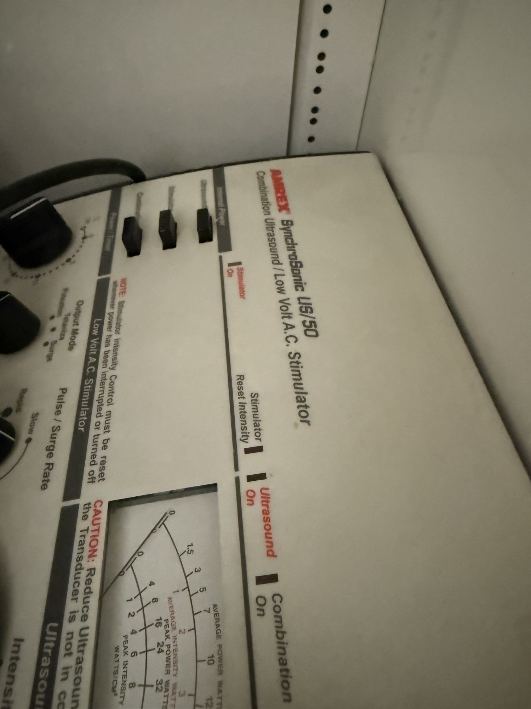

# Physiotherapy ultrasound device + e-stim

| | |
|---|---|
| **Official inventory name** | Physiotherapy ultrasound device + e-stim |
| **Manufacturer** | Amrex |
| **Model** | Synchrosonic US/50 |
| **Category** | TRANSDUCER |
| **Asset #** | _TODO_ |
| **Location** | Zderic Lab, GW SEH |
| **Status** | in official inventory |

## Photos
_1 photo in `photos/`._
## Purpose
Physiotherapy US (1/3 MHz) with optional electrical stimulator.

## Basic operating principle
_TODO_

## Typical settings
_TODO_

## Safety considerations
_TODO_

## Connected equipment / typical workflow
_TODO_

## Manuals / datasheet / website
- Manual: _TODO (add PDF to `../../Manuals/amrex/`)_
- Datasheet: _TODO_
- Website: _TODO_
- QR code: _TODO_

## Relevant publications
- _TODO_

## Research ideas (what could we do with this today?)
- _TODO_

## Lab notes
<!-- date / who / what happened. Append freely. -->
