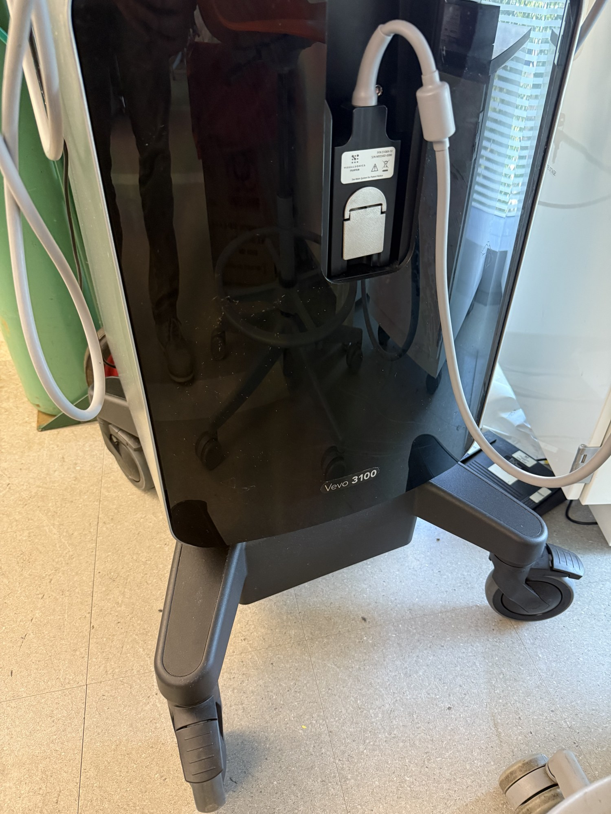

# Small-animal ultrasound imager

| | |
|---|---|
| **Official inventory name** | Small-animal ultrasound imager |
| **Manufacturer** | VisualSonics |
| **Model** | Vevo 3100 |
| **Category** | IMAGING |
| **Asset #** | _TODO_ |
| **Location** | Zderic Lab, GW SEH |
| **Status** | in official inventory |

## Photos
_1 photo in `photos/`._
## Purpose
Ultra-high-resolution small-animal ultrasound imaging (micro-vascular, Doppler, contrast, elastography).

## Basic operating principle
_TODO_

## Typical settings
_TODO_

## Safety considerations
_TODO_

## Connected equipment / typical workflow
probe -> RF -> image -> analysis

## Manuals / datasheet / software
- **VisualSonics Vevo 3100 (Fujifilm):** https://www.visualsonics.com/product/imaging-systems/vevo-3100
- QR code: _generate from the Manual/software URL above_

## Relevant publications
- _TODO_

## Research ideas (what could we do with this today?)
- _TODO_

## Lab notes
<!-- date / who / what happened. Append freely. -->
