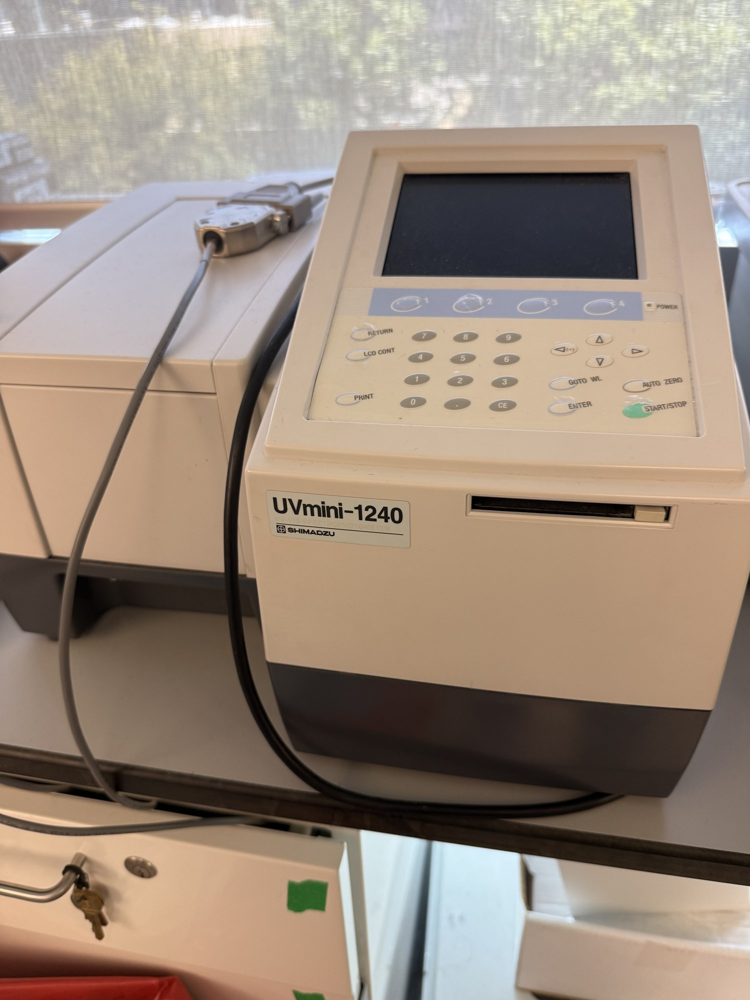

# Spectrophotometer

| | |
|---|---|
| **Official inventory name** | Spectrophotometer |
| **Manufacturer** | Shimadzu |
| **Model** | UVmini-1240 (+ UV-6300PC 2nd unit) |
| **Category** | BIO |
| **Asset #** | _TODO_ |
| **Location** | Zderic Lab, GW SEH |
| **Status** | confirmed (photo) |

## Photos
_2 photos in `photos/`._
## Purpose
UV/Vis spectrophotometer (standard cuvettes). CONFIRMED in photos.

## Basic operating principle
_TODO_

## Typical settings
_TODO_

## Safety considerations
_TODO_

## Connected equipment / typical workflow
_TODO_

## Manuals / datasheet / website
- Manual: _TODO (add PDF to `../../Manuals/shimadzu/`)_
- Datasheet: _TODO_
- Website: _TODO_
- QR code: _TODO_

## Relevant publications
- _TODO_

## Research ideas (what could we do with this today?)
- _TODO_

## Lab notes
<!-- date / who / what happened. Append freely. -->
