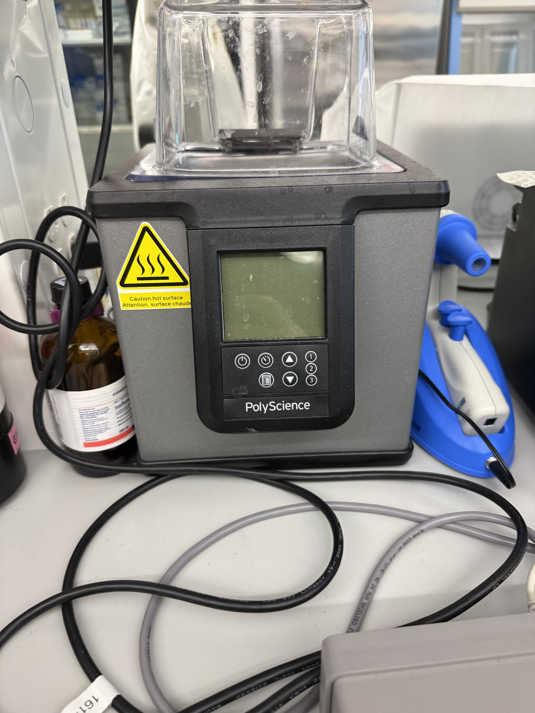

# Open bath circulator

| | |
|---|---|
| **Official inventory name** | Open bath circulator |
| **Manufacturer** | Thermo Fisher / Haake |
| **Model** | **SC100** |
| **Category** | WATER |
| **Asset #** | _TODO_ |
| **Location** | Zderic Lab, GW SEH |
| **Status** | confirmed 2026-08-17 - this is the Haake SC100 |

## Photos
_4 photos in `photos/`._
## Purpose
Temperature-controlled bath / immersion circulator, set-point for the tank.

**Confirmed 2026-08-17 as the Thermo Fisher Haake SC100.** The earlier "Fisher Scientific, model -"
entry and the note about a PolyScience bath in the photos were the same ambiguity; if a PolyScience
unit is also present it is a separate item and needs its own entry.

**This is NOT the flow source for Doppler.** A circulator moves fluid but gives no calibrated
velocity in a defined geometry. Velocity ground truth comes from the Omega FPU5-MT peristaltic
pump, Equipment item 39. Use the SC100 for tank temperature, which matters because the speed of
sound in water runs about 1480 m/s at 20 C and every time-of-flight to distance conversion in
this project assumes it.

## Basic operating principle
_TODO_

## Typical settings
_TODO_

## Safety considerations
_TODO_

## Connected equipment / typical workflow
_TODO_

## Manuals / datasheet / website
- Manual: _TODO (add PDF to `../../Manuals/fisher-scientific/`)_
- Datasheet: _TODO_
- Website: _TODO_
- QR code: _TODO_

## Relevant publications
- _TODO_

## Research ideas (what could we do with this today?)
- _TODO_

## Lab notes
<!-- date / who / what happened. Append freely. -->
