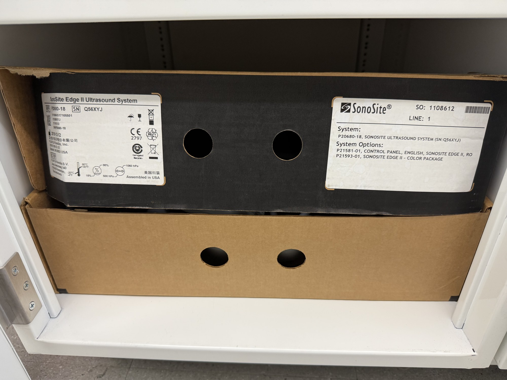

# Portable clinical US imager

| | |
|---|---|
| **Official inventory name** | Portable clinical US imager |
| **Manufacturer** | Sonosite |
| **Model** | Micromaxx / Edge II (HFL38 linear, P10 cardiac) |
| **Category** | IMAGING |
| **Asset #** | _TODO_ |
| **Location** | Zderic Lab, GW SEH |
| **Status** | in official inventory |

## Photos
_2 photos in `photos/`._
## Purpose
Clinical B-mode/Doppler imaging; images the flow phantom during Doppler/MFV tests; intro-to-ultrasound teaching.

## Basic operating principle
_TODO_

## Typical settings
_TODO_

## Safety considerations
_TODO_

## Connected equipment / typical workflow
phantom -> Sonosite -> velocity

## Manuals / datasheet / software
- **Sonosite (Fujifilm):** https://www.sonosite.com/
- QR code: _generate from the Manual/software URL above_

## Relevant publications
- _TODO_

## Research ideas (what could we do with this today?)
- _TODO_

## Lab notes
<!-- date / who / what happened. Append freely. -->
