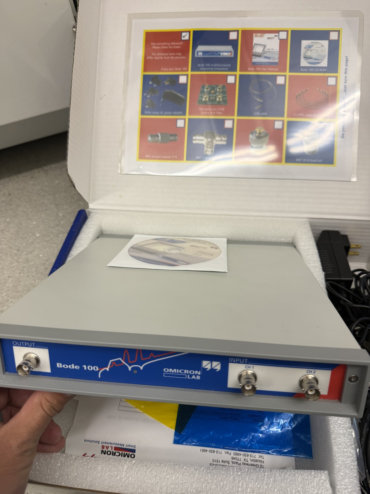

# Impedance analyzer

| | |
|---|---|
| **Official inventory name** | Impedance analyzer |
| **Manufacturer** | Omicron Lab |
| **Model** | Bode 100 (confirmed via catalog) |
| **Category** | MEASURE |
| **Asset #** | _TODO_ |
| **Location** | Zderic Lab, GW SEH |
| **Status** | verified (photo) - Bode 100, the Step-1 impedance/poling instrument |

## Photos
- `photos/IMG_8102.jpg` - the Bode 100 analyzer.

> **Full operating manual:** Bode-100_usage_manual.md (step-by-step procedure,
> automation scripts, poling signature, troubleshooting, and the reference result). Vendor manuals are
> included in this folder (see Manuals below).

## Purpose
Measures electrical impedance vs frequency: series/parallel resonance (fs/fp), |Z| at resonance, coupling. Confirms poling and sets the drive frequency + matching network.

## Basic operating principle
One-port vector impedance: the analyzer sweeps a small signal across frequency and reports Z (magnitude and
phase) of the element. A poled piezo shows series resonance fs (|Z| minimum) and parallel resonance fp (|Z|
maximum just above fs). Effective coupling k_eff^2 = (fp^2 - fs^2)/fp^2. fs is the drive frequency for the
acoustic steps; |Z| at fs indicates how much matching is needed toward 50 ohm.

## Typical settings
- Sweep 0.5-3.0 MHz, logarithmic, 800 points (or ~1200 for a smooth trace), receiver bandwidth ~100 Hz.
- One-port impedance measurement. Uncalibrated is fine for poling go/no-go and fs; do an Open/Short/Load user
  calibration in the GUI for accurate absolute |Z|/fs.
- Firmware: launch the Bode Analyzer Suite GUI once to upload firmware (device goes PID_F000 -> PID_0013),
  then close it so the automation interface can claim the device.

## Safety considerations
- Small measurement signal only, no high voltage. Measure the passive element; never connect the analyzer to
  a transducer being driven by the pulser or RF amplifier (disconnect from the drive chain first).
- ESD care with bare piezo elements. Do not exceed the analyzer input limits.

## Connected equipment / typical workflow
element (coax pigtail: red = hot, black = foil/ground) -> SMA-to-BNC adapter -> BNC cable -> Bode 100
measurement port. Scripts: `automation/bode_selftest.py` (run first), `bode_impedance_sweep.py`,
`bode_sweep_trace.py`. Data: `automation/bode_log.csv`, `bode_traces/`, `bode_figures/`.

## Manuals / datasheet / software
- Bode Analyzer Suite User Manual (in this folder): Bode-Analyzer-Suite-User-Manual.pdf - source https://www.omicron-lab.com/fileadmin/assets/Bode-Analyzer-Suite/Documents/Bode-Analyzer-User-Manual.pdf
- Bode 100 Quick Start Guide (in this folder): Bode-100-Quick-Start-Guide.pdf - source https://www.omicron-lab.com/fileadmin/assets/Bode_100/Documents/Bode-100-Quick-Start-Guide.pdf
- App note (impedance): https://www.omicron-lab.com/fileadmin/assets/Bode_100/ApplicationNotes/Impedance_Measurement_methods_using_the_Bode_100/2020-10-21_Bode_Appnote_Impedance_Measurements_V1_0.pdf
- Software - Bode Analyzer Suite (free): https://www.omicron-lab.com/downloads/bode-analyzer-suite
- Automation (Python COM API): https://documentation.omicron-lab.com/BodeAutomationInterface/3.51/articles/1_Start.html  |  scripts: `automation/bode_*.py` (`pip install pywin32 numpy`)
- Website: https://www.omicron-lab.com/products/vector-network-analysis/bode-100
- QR code: _generate from the Manual/software URL above_

> Vendor manuals above are OMICRON copyrighted documents, kept for internal lab reference (private repo);
> remove them if this repo is ever made public.

## Relevant publications
- _TODO_

## Research ideas (what could we do with this today?)
- _TODO_

## Lab notes
<!-- date / who / what happened. Append freely. -->
