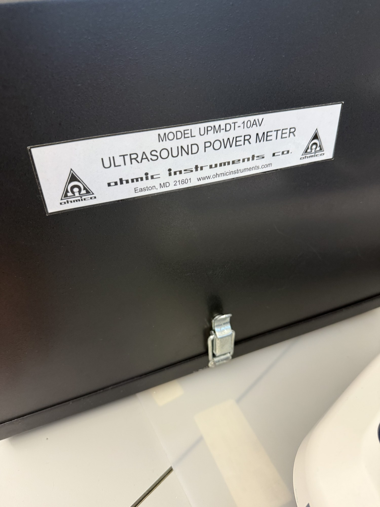

# Reflective radiation force balance

| | |
|---|---|
| **Official inventory name** | Reflective radiation force balance |
| **Manufacturer** | Ohmic Instruments |
| **Model** | UPM-DT-10AV |
| **Category** | MEASURE |
| **Asset #** | _TODO_ |
| **Location** | Zderic Lab, GW SEH |
| **Status** | in official inventory |

## Photos
_2 photos in `photos/`._
## Purpose
Reads total acoustic power directly from radiation force on a reflective target. Simplest RFB for a first run.

## Basic operating principle
_TODO_

## Typical settings
_TODO_

## Safety considerations
_TODO_

## Connected equipment / typical workflow
Transducer (down into) -> RFB target

## Manuals / datasheet / software
- **Manual (Ohmic UPM-DT-10AV):** https://static1.squarespace.com/static/5989afe4db29d6b9e128065d/t/5b50b54f562fa7d2dab7d44d/1532015954280/UPM-DT1AV_%26_10AV_Manual.pdf
- **Website:** https://www.ohmicinstruments.com/
- QR code: _generate from the Manual/software URL above_

## Relevant publications
- _TODO_

## Research ideas (what could we do with this today?)
- _TODO_

## Lab notes
<!-- date / who / what happened. Append freely. -->
