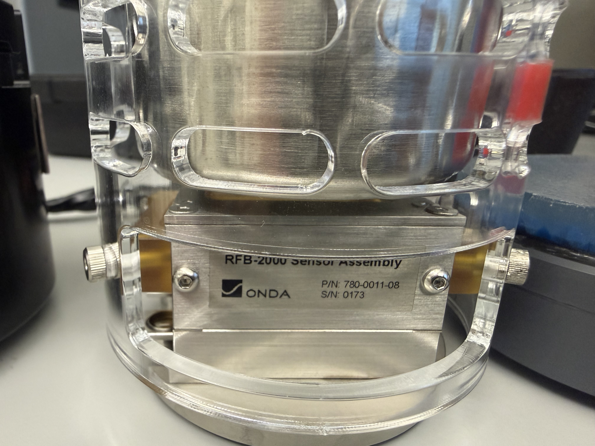
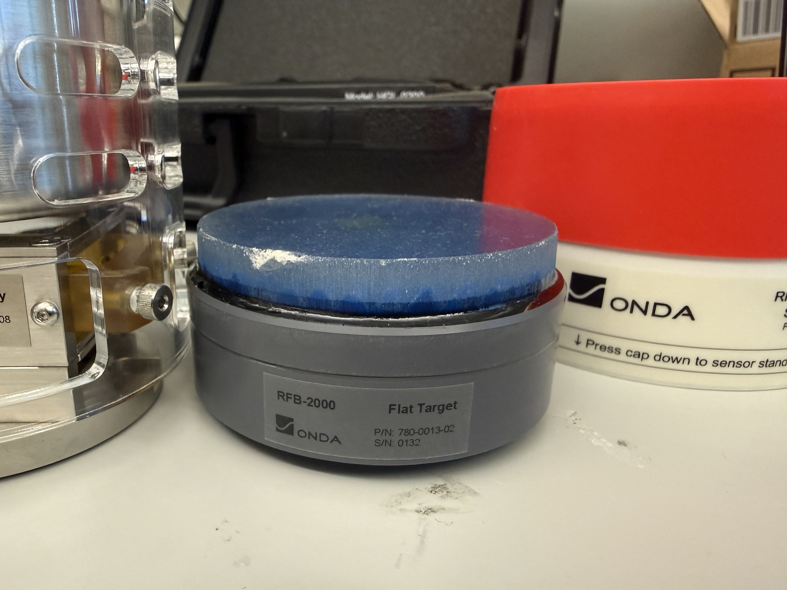
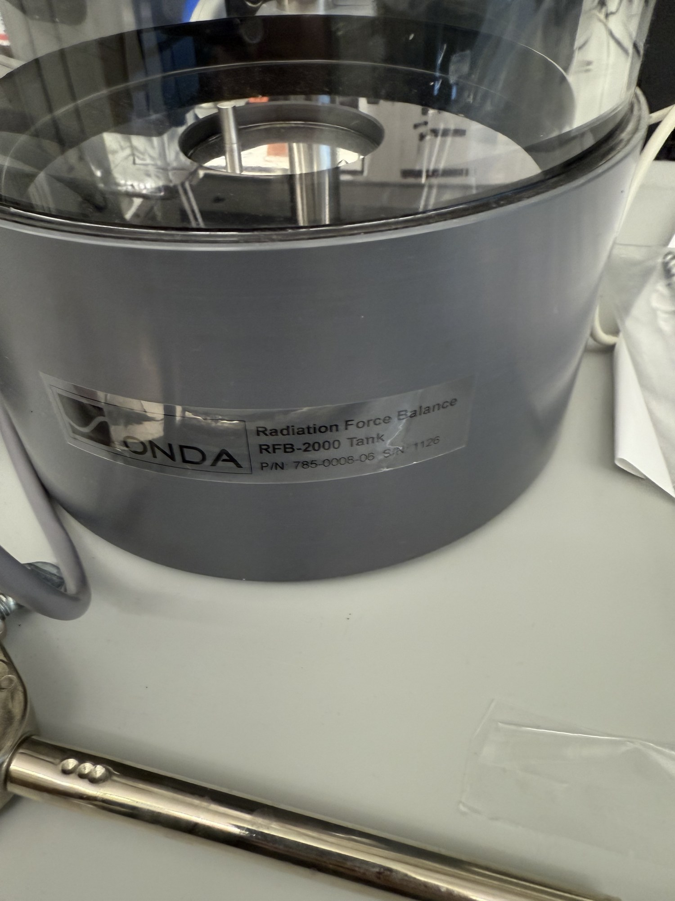
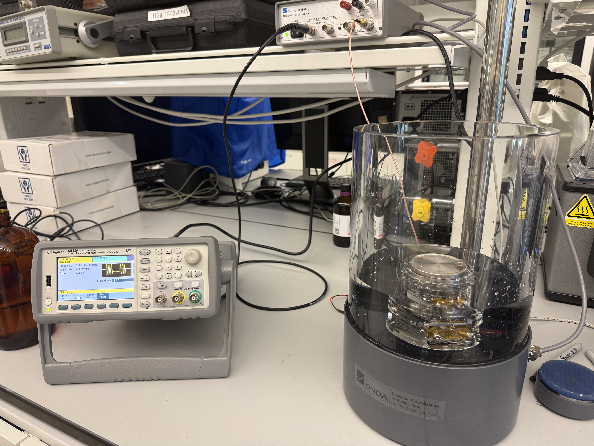
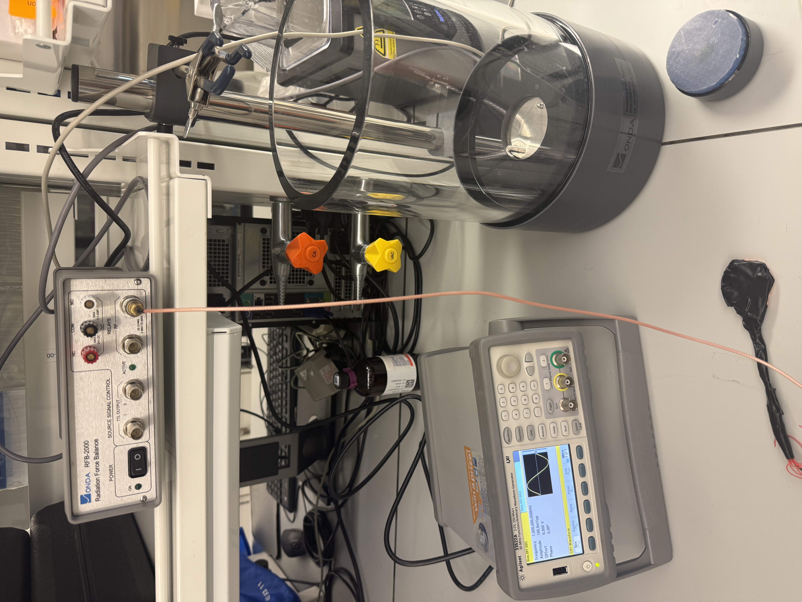
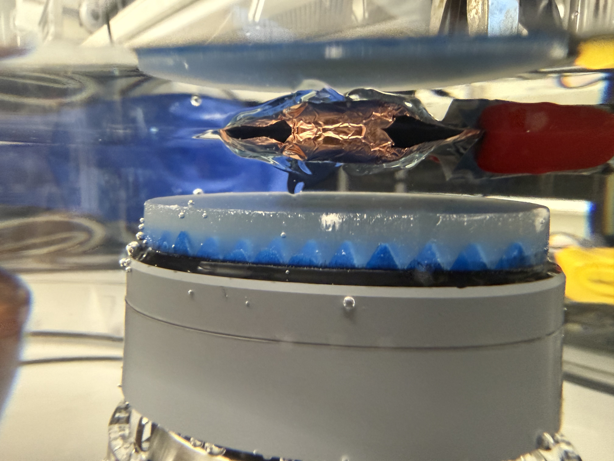
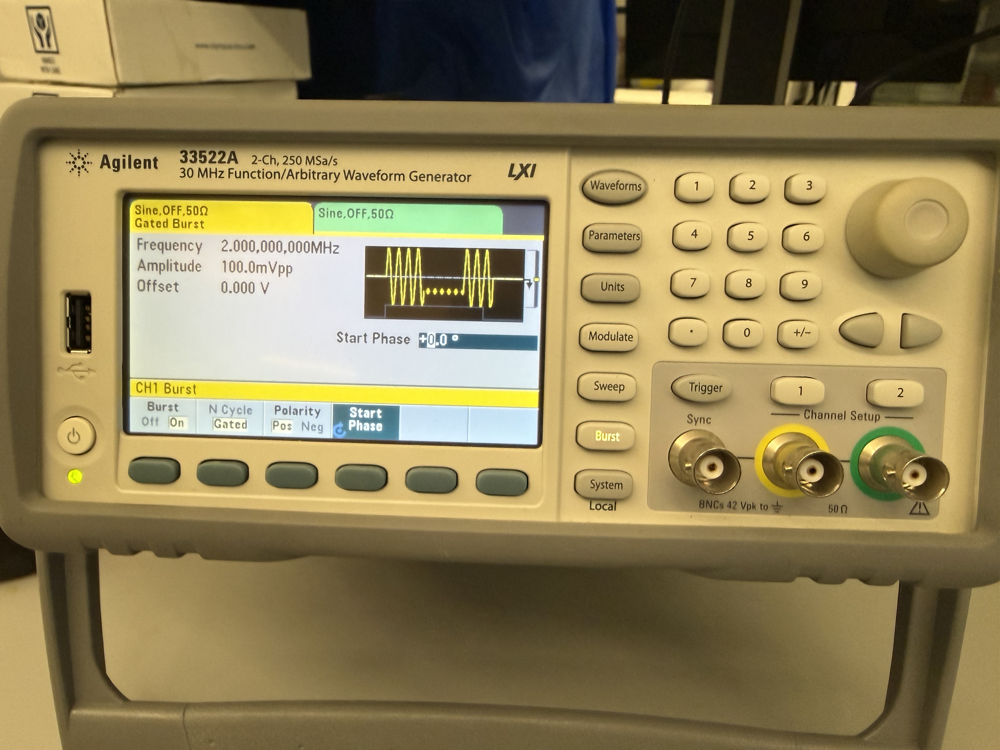

# Onda RFB-2000 - Operating Manual (Acoustic Power)

Procedure for measuring the acoustic output power of an ultrasound transducer on the Onda RFB-2000
radiation force balance in the Zderic Ultrasound Laboratory.

Instrument: Onda RFB-2000. Tank P/N 785-0008-06 S/N 1126; sensor assembly P/N 780-0011-08 S/N 0173;
flat absorbing target P/N 780-0013-02 S/N 0132. Control software RFB.exe 2.0.12.0
(`C:\Program Files (x86)\RFB`); tank interface FTDI USB-serial (COM5).

| | |
|---|---|
|  |  |
| Sensor assembly (P/N 780-0011-08, S/N 0173) in its protective acrylic cage - handle only by the cage. | Flat absorbing target (P/N 780-0013-02, S/N 0132), the blue absorber on its magnetic base. |

Inventory note: this lab holds the controller, the standard tank, the sensor assembly, the flat
absorbing target, and the 1 g calibration mass. The cone target (to ~20 W), brush target
(to ~100 W), submersible tank, and digital position readout shown in Onda's datasheet are optional
accessories and are not in the current inventory. Measurements above ~2 W would require acquiring the
appropriate higher-power target.

| | |
|---|---|
|  |  |
| Controller - power, source-signal control (TTL gate outputs), RF relay, DC relay posts. | Tank - clear-walled, with the sensor and target assembly visible inside. |



*Measurement bench: the 33522A function generator (left) drives the transducer; the RFB-2000 controller
(top shelf) and the water tank with the sensor and target (right) complete the setup.*

## 1. Principle and range
The instrument measures total time-averaged acoustic power in watts. The ultrasound beam transfers
momentum to an absorbing target, and the precision balance reads the resulting force as an apparent change
in mass. Because the measurement is an average, the transducer must be driven continuously (CW) or in
long holds during a reading, not in short low-duty pulses.

- Absorbing-target relation (Onda manual §5.1.2, Eq. 1): P = c F = c m g, with c the temperature-
  dependent speed of sound (~1480 m/s; the software computes it from the tank temperature).
- Scale constant: approximately 14.5 mW per mg of radiation force (Onda cites the traditional figure
  ~67 mg/W, i.e. ~14.9 mW/mg; the exact value tracks water temperature through c). A 1 g mass reads
  about 14.65 W.
- Flat absorbing target range: ~1 mW to 2 W (Onda manual §5.1.2). Above 2 W, Onda offers the optional
  cone target (to ~20 W, §5.1.3) or brush target (HIFU, §5.1.4) - see the inventory note above.
- Diagnostic-level output lies near the balance noise floor (~0.3 mg, a few mW); calibration,
  degassing, and averaging are therefore critical at these levels (Onda manual §5.2, §5.3).

## 2. Required equipment
- RFB-2000 balance, controller, and flat absorbing target, in a tank of clean, degassed water.
- Function generator: Agilent/Keysight 33522A (S/N MY50002208), driving the transducer directly for
  diagnostic levels, or through an RF amplifier for higher power.
- Transducer under test, mounted facing the target.
- Laboratory PC with the RFB software and 64-bit Python 3.11 (required to match RFBClient64.dll).
- 1 g reference calibration mass (supplied with the instrument).

## 3. Software and control
- Graphical interface: RFB.exe, `C:\Program Files (x86)\RFB`. The tank connects by USB (FTDI; the CDM
  driver is included with the installation). Installer (lab copy):
  https://drive.google.com/file/d/117BFBbwS1HwAOGMXYo2Cyyz8-ZTtRxIr/view?usp=sharing
- Programmatic control: RFBClient64.dll operates as a client to the running RFB.exe over a localhost
  TCP socket. RFB.exe must be open with the tank connected before any script can communicate with it.



*Controller front panel: POWER, SOURCE SIGNAL CONTROL (TTL OUTPUT gate lines and the ACTIVE indicator),
and the RF / DC relay terminals. The tank's CA (fill) and VAC (vacuum-degas) valves are visible behind it.*
- Calibration, the sensor self-check, and zeroing are performed in the graphical interface; they are not
  exposed through the DLL.
- API boolean convention: -1 denotes TRUE, 0 denotes FALSE (Connected(), Zeroing(), Measuring()).

## 4. Tank and sensor setup
The sensor and target must not be lowered into a dry tank. Follow this order (Onda manual §7.3):
1. Partially fill the tank to approximately sensor height, allowing inspection for bubbles beneath the sensor.
2. Install the sensor by its protective cage. It seats in a single orientation: a slot mates the
   square-ended pin on the tank base, and the pointed pin drops into the opposite hole. Seat it fully,
   clear of all walls.
3. Inspect for bubbles through the clear tank; swirl gently or clear with the supplied syringe.
4. Add water to cover the target by 15-25 mm (Onda manual §7.3.4; 1 cm is the absolute minimum, §5.2 /
   §7.1.4). If calibrating with the mass first, fill to about 1 cm, then top up afterward.
5. Install the flat target, which is held by magnets; its three locating pins seat in the center of the
   sensor float. Inspect for bubbles again.
6. Confirm the assembled sensor and target are approximately neutrally buoyant (slight sink or float is
   acceptable; the controller compensates).
7. Zero the balance, perform the 1 g calibration check, allow it to settle thermally, and re-zero.



*The blue pyramidal absorbing target sits on the sensor float; the transducer element (here wrapped in
copper foil) faces it from above, submerged, with water covering both. Clear bubbles from the target and
element faces before measuring.*

## 5. Required checks before measurement
- Remove all shipping locking pins from the sensor. Onda inserts the locking pins only for transport or
  shipping and says to store them in the sensor base when not in use (manual Preface / handling guidelines).
  Left in, they immobilize the float and cause the sensor self-check to fail ("moving part free to move...
  software will close"). With the pins removed, the float rises to the top of its range and returns from a
  light 1 mm displacement, and the check passes.
- Zero the balance undisturbed (auto-zeroing, manual §10.3). If the balance remains in Zeroing() and a
  measurement cannot start
  ("Cannot start while Zeroing"), the float is resting against a rail. Turn the drive off, restart RFB.exe,
  and allow the balance to zero without any contact; it converges within seconds to grams near zero and
  position near zero. Any disturbance of the bench or cabling during zeroing returns the float to a rail.

## 6. Calibration
(Onda manual §6.1 and §9.2.) Calibration is required before the first measurement and sets a constant
(stored in amps/newton, auto-loaded on the next start).
1. With the transducer off, the target in place, and water covering it, zero the balance.
2. Select manual calibration by mass, place the calibration platform vertically on the submerged target
   (half above water, half below), place the 1 g mass on the platform, and enter 1000 mg. Run several
   apply/remove cycles as prompted. The window title clears the "UNCALIBRATED" state and it should read
   about 14.65 W equivalent.
3. Click "Apply this result", then re-zero before measuring.

Onda allows any mass from 0.1 to 5 g but recommends > 0.5 g to minimize vibration noise, and notes the
calibration is best when the weight's force is close to the radiation force you expect to measure (§6.1). The
calibration mass stows at the rear of the instrument; if missing, obtain a replacement from Onda or
substitute a verified 1.000 g mass. Because the 1 g point (~14.65 W) is far above the milliwatt range of
diagnostic transducers, rely on the factory acoustic-power calibration certificate for absolute accuracy at
a few milliwatts (the certificate is a single frequency/power reference, §5.4), and treat near-floor readings
accordingly.

## 7. Driving and gating the transducer
The balance does not drive the transducer; the 33522A does. The two must be synchronized so sound is present
during the measurement (Onda's "Auto Measurement", manual §6.3).

Onda's preferred method (§6.3, §7.2.4): let the RFB gate the source through one of its three controller
outputs, keyed by the software's sound-on control:
- RF relay (two BNCs, 50 ohm, up to 2 W): route `func gen -> RF-relay IN -> RF-relay OUT -> transducer`
  (or through an amplifier). OFF grounds both BNCs through 50 ohm; ON makes a through connection.
- Logic level (two BNCs, active-high 5 V / active-low 0 V): drive the 33522A's external gate/burst
  trigger. Use this above the 2 W RF-relay limit, with an amplifier in line.
- DC relay (three isolated posts, 24 V / 1 A): simulates a "freeze" footswitch closure.
- Modes: Steady State (holds ON through the measurement - use for CW power) vs Pulse On/Off
  (a ~100 ms pulse per transition; the RF relay is not useful in this mode).

This lab's method (software SCPI gating): we currently drive and gate the 33522A directly over USB/SCPI
rather than through the RFB's gate outputs. In early attempts we repeatedly railed the sensor float (it
hit its travel limit, so the balance would not zero or start). We have not isolated the cause, and are
not blaming the TTL gate: likely candidates include a hard on/off drive step overshooting the balance servo,
the zeroing-then-on/off timing sequence, or the external-control API call order (our understanding of the
RFB API behavior is still incomplete). Software gating simply let us ramp the amplitude and control the
timing directly, which produced stable readings. It is a working approach, not a verdict that the hardware
gate is faulty - the RFB hardware gating (Onda's preferred method above) is worth revisiting.
- Control the 33522A over USB/SCPI (pyvisa-py; enumerates as `USB0::2391::8967::MY50002208::0::INSTR` after
  binding WinUSB with Zadig) and switch the drive there.
- Ramp the drive amplitude; do not switch it hard on or off. A hard step is a force step that can
  overshoot the balance servo into its rail even at a few milligrams; ramping between silent and target over
  ~2 s (output left on) avoided the railing. This helps regardless of how the drive is gated.
- Median-filter the readings to reject intermittent glitch spikes.

Either way - drive configuration: Sine, generator output-load setting matched to the cabling, direct drive
for the first reading (up to ~10 Vpp stays within the flat-target range). Introduce an amplifier only for
higher-power sweeps; note the higher-power targets needed above 2 W are not in inventory (see the inventory
note near the top).



*The 33522A set for the transducer drive (here 2 MHz sine, 100 mVpp, 50 ohm output). This lab currently gates
and ramps the drive in software (Section 7); the front-panel gated-burst path was set aside after
sensor-railing issues whose cause has not yet been isolated.*

## 8. Making a measurement
Mount the transducer facing the target, held securely in the tank's clamping arm to prevent movement. For an
absorbing target, keep the transducer-to-target separation greater than 8 mm to avoid thermal coupling
between transducer and target, while otherwise minimizing the distance to limit acoustic streaming
(Onda manual §5.2). Confirm no bubbles on the transducer face.

The measured quantity is a difference: the reading with drive on, minus the reading with drive off. The
baseline carries a fixed zero offset, and only the delta represents acoustic power. Standard sequence:
1. Confirm the balance is zeroed and settled with the drive off, and record the OFF baseline as the median
   of several samples.
2. Ramp the drive to the target amplitude at the transducer's loaded resonance, allow it to settle, and record.
3. Ramp the drive down and record a second OFF baseline. Average the two baselines and subtract.
4. Repeat over several cycles and average. Convert force to power using ~14.5 mW/mg and cross-check against
   the balance's own watts reading.

(Onda's own auto-measurement functions - NewAutoMeasurement, StartMeas/StopMeas, Measuring, GetMean/GetStdDev
in watts - are documented in manual §10.5, but they rely on the RFB gating the source; this lab drives and
gates over SCPI instead, per Section 7.)

The measurement is automated by `automation/rfb_scpi.py`, which drives the 33522A over SCPI and reads
the balance over the DLL (GetGrams/GetWatts/GetPosition/GetTemperature, manual §10.7), ramps the amplitude,
median-filters, waits for a settled balance, and logs every reading to `automation/rfb_scpi_log.csv`. Modes:
```
python rfb_scpi.py measure   --elem <name> --vpp 2 --freq 2.017 --cycles 4
python rfb_scpi.py ampsweep  --elem <name> --freq 2.25 --vpps 0.5,1,2,3,5      # power vs drive
python rfb_scpi.py freqsweep --elem <name> --vpp 2 --fstart 1.8 --fstop 2.8 --fstep 0.05
python rfb_scpi.py cwhold    --elem <name> --freq 2.25 --vpp 2 --hold 30       # timed CW hold
```
Prerequisite: RFB.exe running with the tank connected, and the balance zeroed undisturbed.

## 9. Interpretation and troubleshooting
- A near-zero reading at low drive indicates the noise floor (~0.3 mg), not necessarily a failed
  transducer. Increase the drive, locate the true water-loaded resonance, and increase averaging.
- Glitch spikes or a drifting baseline indicate residual dissolved gas or bubbles on freshly immersed
  surfaces. Boiling degasses incompletely; use vacuum degassing and allow surfaces to shed bubbles. Onda
  recommends degassed, de-ionized water and stresses that no bubbles be trapped on the transducer surface
  (manual §5.2, §7.1.4, §7.1.6). The software's statistics support estimating random uncertainty (§5.3).
- Float railing during a run indicates a force step (hard on/off switching) or a physical disturbance.
  Use ramped drive and keep the bench undisturbed.
- Large, randomly scattered readings indicate an intermittent drive-cable connection rather than real
  power. Reseat or replace the cable.
- A resonance that shifts during sustained drive indicates element self-heating moving the water-loaded
  peak; re-measure the loaded resonance.
- Acoustic power is distinct from acoustic pressure and mechanical index, which are measured with a
  hydrophone (a separate instrument).

## 10. Reference-transducer verification
Before accepting a reading on an unknown or hand-built transducer, verify the drive path, balance, and
method with a known-good reference. The laboratory holds Olympus immersion reference transducers at 1, 2.25,
3.5, and 5 MHz, all BNC-terminated (no adapter required). Begin with the 2.25 MHz unit for elements near 2
MHz. A steady, voltage-squared-scaling power reading confirms the drive path, balance, and method, and
localizes any fault to the transducer under test; a poor reading on the reference indicates an upstream
problem. Reference immersion transducers are sealed, fixed-connector, and broadband, and are driven at their
rated center frequency without resonance hunting.

## 11. Safety and care
(Onda manual Preface, §7.1.5, §7.2.1.)
- The sensor mechanism is fragile; handle it only by its protective cage or baseplate, never by the float,
  and remove the shipping cap before immersion. Do not leave the sensor submerged for extended periods
  (> ~1 week). Store it on its base (integral magnets can be damaged on a magnetic surface). (Preface)
- Use degassed water for measurements above ~1 W to avoid cavitation and bubble errors (§7.1.4, §7.1.6).
- Place only water in the tank. Clean the walls with soap and water or "Brillianize" only; do not use
  alcohol, acetone, or abrasives (§7.1.5).
- The tank-to-controller connector is water-resistant, not water-proof; do not immerse the standard tank
  (§7.2.1).
- Bubbles on the target or transducer face produce a false low reading; clear them with the syringe.
- Do not run high-power CW long enough to heat the bath, as the baseline will drift; pause between drive levels.

## 12. Absorbing versus reflecting balances
This RFB-2000 uses an absorbing target. A reflecting power meter, such as the laboratory's Ohmic UPM
(inventory item 22) with a conical reflecting target, instead reflects the beam. Reflecting meters generally
present a higher noise floor and are better suited to therapy-level intensities; an absorbing balance is
preferred for low-duty, diagnostic-level output. When the same source is measured on both, the reflecting
unit is expected to lose the signal first at low power.

## 13. References
- Onda RFB-2000 Operating Manual (v2.0, 2021-02-22): a copy is included in this folder,
  RFB-2000_OperatingManual_20210222.pdf, along with the
  release notes. It also ships in the RFB software installer
  (download: https://drive.google.com/file/d/117BFBbwS1HwAOGMXYo2Cyyz8-ZTtRxIr/view?usp=sharing); after
  installing, it is at `C:\Program Files (x86)\RFB\RFB-2000_OperatingManual_20210222.pdf`. Sections 7.2
  (connections), 7.3 (tank and sensor), and 6 (measurement) give the manufacturer procedure.
- RFB-2000 datasheet: https://www.ondacorp.com/wp-content/uploads/2020/06/Onda_RFB-2000_DataSheet.pdf
- Onda radiation-force page: https://www.ondacorp.com/radiation-force/
- Software installer (lab copy): https://drive.google.com/file/d/117BFBbwS1HwAOGMXYo2Cyyz8-ZTtRxIr/view?usp=sharing
- Equipment record and lab notebook: this repository (`Equipment/items/23_absorptive-radiation-force-balance/`,
  `LabNotebook/`).
