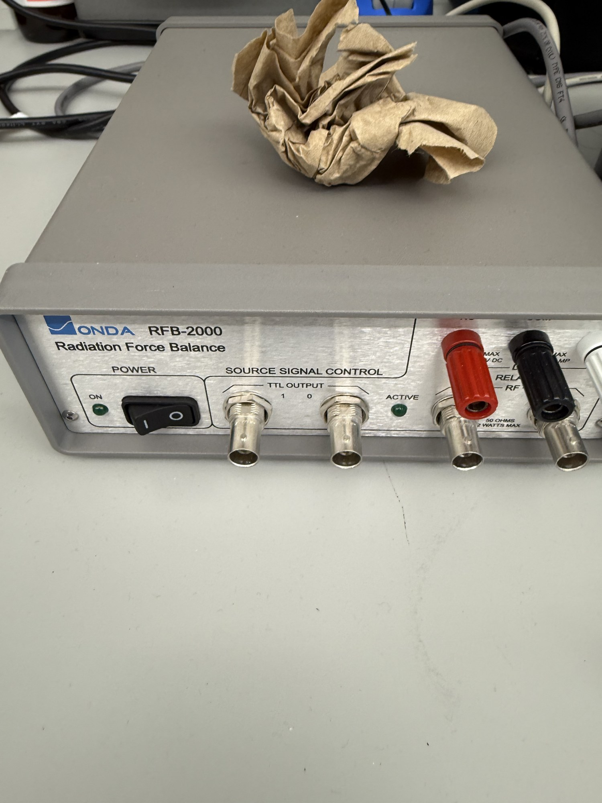

# Absorptive radiation force balance

| | |
|---|---|
| **Official inventory name** | Absorptive radiation force balance |
| **Manufacturer** | Onda |
| **Model** | RFB-2000 |
| **Category** | MEASURE |
| **Asset #** | _TODO_ |
| **Location** | Zderic Lab, GW SEH |
| **Status** | in official inventory |
| **Sensor assembly S/N** | 0173 |
| **Flat absorbing target S/N** | 0132 |

## Photos
_10 photos in `photos/`._
## Purpose
Absorptive-target RFB for **total acoustic power** (SOP Step 3). Reads watts directly, NIST-traceable.

## Basic operating principle
Ultrasound carries momentum; hitting the target exerts a force the precision balance reads as an apparent
mass change. **Absorbing target: W = F·c = m·g·c** (c ~ 1480 m/s, auto-corrected for water temp by the
software). Rule of thumb: **1 mg ~ 14.5 mW**. Flat target range **~1 mW - 2 W** (cone kit to 20 W, brush
kit to 100 W). The **software reports total acoustic power directly** - no manual factor needed.

## Typical settings
- **Standard flat target (S/N 0132):** 1 mW - 2 W. Don't exceed ~2 W on the flat target (bad accuracy) -
  use the cone/brush target for higher power.
- Enter **sensor serial 0173** in the GUI (saved into each data file).
- Water level: cover the target by **1.5 - 2.5 cm**. For the 1 g mass calibration, ~1 cm above the target
  so the mass platform sits accessible.
- **Calibration check:** transducer OFF, zero; place the supplied **1 g mass platform** on the target ->
  should read **~14.65 W** (radiation-force equivalent of 1 g). Zero before each reading.

## Safety considerations
- **Sensor mechanism is fragile** - handle ONLY by the protective acrylic cage/enclosure. Remove the red
  shipping cap before immersing.
- **Degassed water** for measurements > 1 W (cavitation / bubble errors). We degas with the Ted Pella
  vacuum setup; verify low DO.
- **Never** put anything but water in the tank; clean walls with water or "Brillianize" only - no alcohol,
  acetone, or abrasives.
- Tank-to-controller connector is **water-resistant, not water-proof** - don't immerse the standard tank.
- Bubbles on the target/face = false low reading. Use the provided **syringe** to blow them off.
- Don't run high-power CW long enough to heat the bath (baseline drifts); pause between levels.

## Connected equipment / typical workflow

### A. Physical setup order (manual sec. 7.3 - do NOT lower sensor+target into a dry tank)
1. **Partial-fill** the tank to roughly the **sensor height** first (lets you spot bubbles under the sensor).
2. **Install the sensor** (by its cage). Seats in ONE orientation: slot mates the square-ended pin on the
   tank base, pointed pin drops into the opposite hole. Fully seated, not touching any wall.
3. **Bubble check** through the clear tank; swirl gently or use the kit syringe.
4. **Top up water** to cover the target by 1.5 - 2.5 cm (or ~1 cm above target if calibrating with the mass
   platform first, then add the rest for transducer-target standoff).
5. **Install the flat target** - held by internal magnets; three bottom pins fit the recessed center of the
   sensor float for alignment. Check for bubbles again.
6. **Buoyancy check** - combined sensor+target should be ~neutrally buoyant (slight sink/float OK, the
   controller compensates).
7. Zero, run the **1 g calibration check (~14.65 W)**, let it **thermally settle**, re-zero.

### B. Drive gating - the RFB keys the sound; it does NOT drive the transducer (manual sec. 7.2.4)
The transducer is driven by the **function generator (Agilent/Keysight 33522A)**, optionally through an amp
(**Sonic Concepts AMP-200S** = purpose-built ultrasound RF amp, preferred over the AR 150A100B whose low-end
gain knee is uncontrollable). The RFB synchronizes sound on/off with the measurement via one of three
controller outputs:
- **RF relay (2 BNCs):** switches the RF line directly, **50 ohm, <= 2 W** (off = both BNCs grounded thru
  50 ohm; on = through-path). Route drive through it: `33522A -> RF-relay IN -> RF-relay OUT -> transducer`.
- **Logic level (2 BNCs):** active-high 5 V / active-low 0 V TTL -> the **33522A external gate/burst trigger**.
  Use when driving **> 2 W** (past the RF-relay limit) with the amp in-line.
- **DC relay (3 posts):** isolated, 24 V / 1 A - simulates a "freeze" footswitch closure.
- Modes: **Steady State** (holds on through the measurement - use for CW power) vs **Pulse On/Off**
  (100 ms pulse per transition; RF relay not useful here).

**Recommended gentle first run (stays <= 2 W):** drive the array **directly from the 33522A** (<=10 Vpp
~ 0.1-0.25 W, within the flat-target range and under the RF-relay rating): `33522A -> RF-relay IN ->
RF-relay OUT -> array`, **Steady-State** mode. Do NOT put an amp here for the first reading - power above
2 W would exceed the RF relay and cook the flat target. For the **power sweep** toward board-relevant
30-50 V drive, add the **Sonic Concepts AMP-200S** (not the AR), switch to **logic gating** (amp output
exceeds the 2 W RF relay), keep the **Bird** in-line, and move to the **cone target** above ~2 W.

### C. Scriptable
`RFBClient64.dll` client to the running `RFB.exe` GUI over a localhost TCP socket. Repo tooling:
`automation/rfb_power_measure.py` (+ `run_rfb.bat`) logs mean W / SD / grams / temp. See the
`rfb-2000-automation` memory / [[gwu-ultrasound-lab]]. `run_rfb.bat --check` = no-drive handshake.

## Manuals / datasheet / software
- **Operating manual (v2.0, 2021-02-22):** `C:\Program Files (x86)\RFB\RFB-2000_OperatingManual_20210222.pdf`
  (secs. 7.2 Connections, 7.3 Tank & Sensor, 6 Measurement).
- **Datasheet (Onda RFB-2000):** https://www.ondacorp.com/wp-content/uploads/2020/06/Onda_RFB-2000_DataSheet.pdf
- **Website:** https://www.ondacorp.com/radiation-force/
- Software + demos: `C:\Program Files (x86)\RFB` (RFB.exe, DLLs), `C:\Users\Public\Documents\RFB`
  (Delphi/Matlab demos, RFBClient64Interface.h).

## Relevant publications
- _TODO_

## Research ideas (what could we do with this today?)
- _TODO_

## Lab notes
<!-- date / who / what happened. Append freely. -->
- **2026-07-23 (Kevin):** First bring-up. Confirmed setup order from the operating manual (partial-fill ->
  sensor -> de-bubble -> fill -> target -> buoyancy -> zero + 1 g cal). Plan: gentle first power reading on
  the sealed array, driven **directly from the 33522A through the RFB RF relay** (Steady-State, <= 2 W), no
  amp. Pivoted here from the Ohmic UPM-DT-10AV (wrong tool for bare thin discs - see LabNotebook
  2026-07-17). Degassed water ready.
