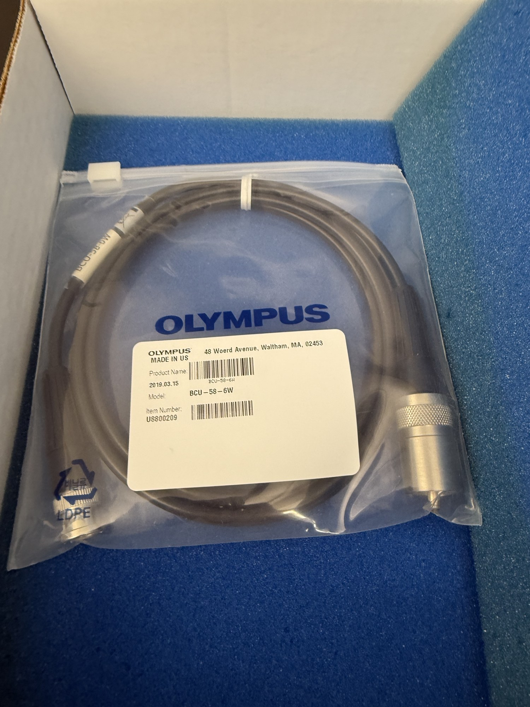

# Unfocused reference transducers

| | |
|---|---|
| **Official inventory name** | Unfocused reference transducers |
| **Manufacturer** | Olympus |
| **Model** | 0.5 / 1 / 3.5 / 5 MHz (one confirmed: BCU-58-6W) |
| **Category** | TRANSDUCER |
| **Asset #** | _TODO_ |
| **Location** | Zderic Lab, GW SEH |
| **Status** | in official inventory |

## Photos
_1 photo in `photos/`._
## Purpose
Calibrated unfocused immersion transducers; the reference comparison for detection-floor and pulse-echo work.

## Basic operating principle
_TODO_

## Typical settings
_TODO_

## Safety considerations
_TODO_

## Connected equipment / typical workflow
pulser/receiver -> transducer -> echo

## Manuals / datasheet / website
- Manual: _TODO (add PDF to `../../Manuals/olympus/`)_
- Datasheet: _TODO_
- Website: _TODO_
- QR code: _TODO_

## Relevant publications
- _TODO_

## Research ideas (what could we do with this today?)
- _TODO_

## Lab notes
<!-- date / who / what happened. Append freely. -->
