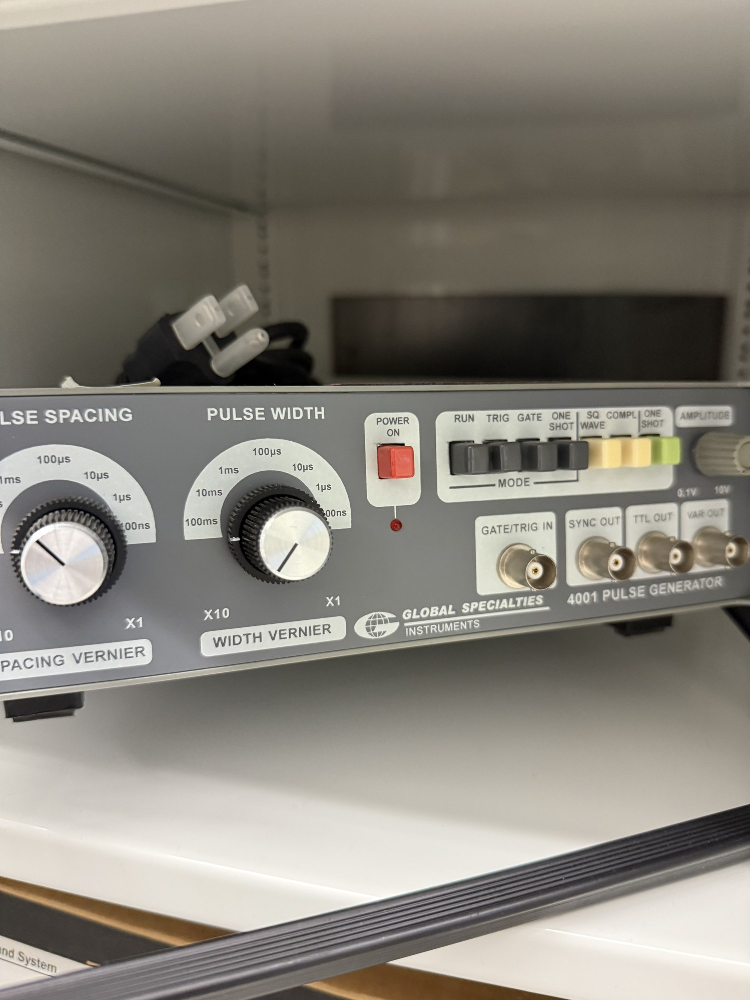

# Pulse generators (x3)

| | |
|---|---|
| **Official inventory name** | Pulse generators (x3) |
| **Manufacturer** | Global Specialties |
| **Model** | 4001 |
| **Category** | DRIVE |
| **Asset #** | _TODO_ |
| **Location** | Zderic Lab, GW SEH |
| **Status** | confirmed (photos 2026-07) |

## Photos
_Add 1-6 photos to `photos/`._ (on hand: two 4001 front panels.)

## Purpose
Pulse/timing generators for the driving system and gating.

## Front-panel controls (from photos)
- **Pulse Spacing** (PRF period): 100 ns to 100 ms, with X10/X1 spacing vernier.
- **Pulse Width:** 100 ns to 100 ms, with X10/X1 width vernier.
- **Amplitude:** 0.1 V to 10 V.
- **Mode:** RUN / TRIG / GATE / ONE SHOT / SQ WAVE / COMPL / ONE SHOT.
- **I/O:** GATE/TRIG IN, SYNC OUT, TTL OUT, VAR OUT (BNC).

## Basic operating principle
Sets pulse repetition period (spacing) and width independently; outputs TTL and a variable-amplitude pulse. Use as the trigger/timing source, or the SYNC/TTL out to gate other instruments (scope capture, RFB source-signal control).

## Typical settings
- For pulsed-Doppler emulation: set spacing = PRF period (e.g. 1 kHz -> 1 ms), width = burst length, feed SYNC OUT to the scope trigger.

## Safety considerations
_TODO_

## Connected equipment / typical workflow
_TODO_

## Manuals / datasheet / website
- Manual: _TODO (add PDF to `../../Manuals/global-specialties/`)_
- Datasheet: _TODO_
- Website: _TODO_
- QR code: _TODO_

## Relevant publications
- _TODO_

## Research ideas (what could we do with this today?)
- _TODO_

## Lab notes
<!-- date / who / what happened. Append freely. -->
