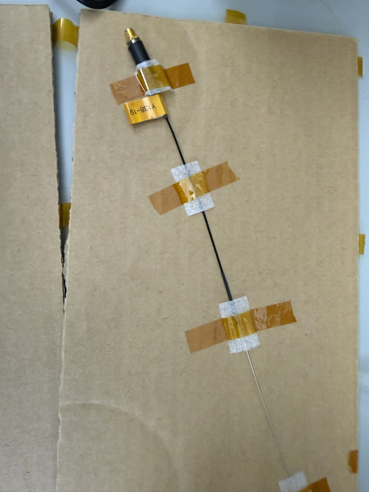

# Omnidirectional hydrophone

| | |
|---|---|
| **Official inventory name** | Omnidirectional hydrophone |
| **Manufacturer** | Sonic Concepts |
| **Model** | **Y-138**, serial **019** (marked `Y138-19` on the housing) |
| **Category** | MEASURE |
| **Asset #** | _TODO_ |
| **Location** | Zderic Lab, GW SEH 5290 |
| **Status** | **CONFIRMED 2026-09-09** (photographed, certificate of analysis on hand) |

## Photos
- `photos/Y-138-019_hydrophone.jpg` - the probe, taped out on card. Gold Kapton collar
  carries the handwritten `Y138-19`, SMA connector at the top, and the fine needle
  element on the thin lead at the bottom.
- `photos/Y-138-019_certificate_of_analysis.jpg` - Sonic Concepts certificate.

## Purpose
Omnidirectional hydrophone for total-field measurements, where a directional probe would
under-read anything arriving off its axis. Useful for standing-wave and reverberation
checks in the tank, and as a cross-check on a directional probe's alignment.

## What the certificate actually says

From the Sonic Concepts **Certificate of Analysis**, author R. VanSickle, dated
**2021-01-21**, measured **in a wet anechoic environment** (file `Y-138 SN019 Wet`):

| | |
|---|---|
| Description | Omnidirectional hydrophone, **11 cm insertion length**, 2 m SMA-to-BNC extension cable provided |
| Orientation | **Theta = 0 degrees is indelibly marked on the housing** |
| Hydrophone capacitance | **130 pF** |
| Z magnitude at 2.5001 MHz | **488.833 ohms** |
| Z phase angle at 2.5001 MHz | **-64.288 degrees** |
| Plot range | 0 to 5 MHz, 0 to 750 ohms |

> **THIS IS AN ELECTRICAL CERTIFICATE, NOT A SENSITIVITY CALIBRATION.** It gives
> capacitance and isolated electrical impedance. It does **not** give an end-of-cable
> sensitivity in V/Pa or dB re 1 V/uPa, so **this probe cannot produce an absolute
> pressure on its own.** Anything quantitative (MI, I_SPTA, peak negative pressure) has
> to come from the calibrated needle hydrophone, item 31, which does carry a sensitivity
> calibration. Use this one for relative field shape, nulls, and symmetry.

## Basic operating principle
A piezo element small compared with the wavelength responds to pressure from any
direction, so its output tracks the scalar pressure at a point rather than the component
along an axis. The trade is sensitivity and, at higher frequencies, spatial averaging
once the element stops being small relative to the wavelength.

The impedance plot matters for loading: at 2.5 MHz the source impedance is about 489
ohms at -64 degrees, which is capacitive and high. Feeding that straight into a 50 ohm
input divides the signal heavily, so it wants the preamp (item 31's AG-2010) or a
high-impedance front end. Capacitance of 130 pF also means cable capacitance is not
negligible; the supplied 2 m SMA-to-BNC cable is part of the calibrated configuration
and swapping it changes the loading.

## Typical settings
_TODO - depends on the measurement. Record preamp gain and scope termination with any
result taken with this probe._

## Safety considerations
- **11 cm insertion length** and a fine exposed element on a thin lead. Mechanically
  fragile; the element is the part that breaks.
- Do not run it dry. Cavitation at the element in air-backed conditions will damage it.
- Theta = 0 is marked on the housing. Record the orientation used, since "omnidirectional"
  is an approximation that degrades with frequency.

## Connected equipment / typical workflow
- 2 m SMA-to-BNC extension cable (supplied, part of the calibrated configuration)
- Preamplifier, item 31, or a high-impedance scope input
- Oscilloscope, item 35
- Positioning by the XY-9 stage, item 37, for any rastered field map

## Manuals / datasheet / website
- Manual: _TODO (add PDF to `../../../Manuals/sonic-concepts/`)_
- Certificate of analysis: `photos/Y-138-019_certificate_of_analysis.jpg`
- Website: sonicconcepts.com
- QR code: _TODO_

## Relevant publications
- _TODO_

## Research ideas (what could we do with this today?)
- **Standing-wave check in the tank.** A directional probe pointed at the source
  under-reads the reflected field. This one does not, so comparing the two is a direct
  read on how reverberant the tank is at a given frequency.
- **Cross-check hydrophone alignment.** If the needle probe's peak and this one's peak
  disagree in position, the needle is off-axis rather than the field being odd.

## Lab notes
<!-- date / who / what happened. Append freely. -->
- **2026-09-09** Photographed and identified. **Sonic Concepts Y-138, serial 019**,
  which fills in the blank model field on this page and moves item 32 off the
  not-yet-photographed list. Certificate of analysis dated 2021-01-21 is on hand.
  - **The certificate is electrical only.** Capacitance 130 pF, and impedance
    488.833 ohms at -64.288 degrees at 2.5001 MHz, measured wet and anechoic. There is
    no V/Pa sensitivity figure, so absolute pressure from this probe is not available
    and should not be quoted. Item 31 remains the only probe here that can give one.
  - Worth asking Sonic Concepts whether a sensitivity calibration exists for SN 019 or
    can be bought. Without it this is a relative-measurement instrument.
