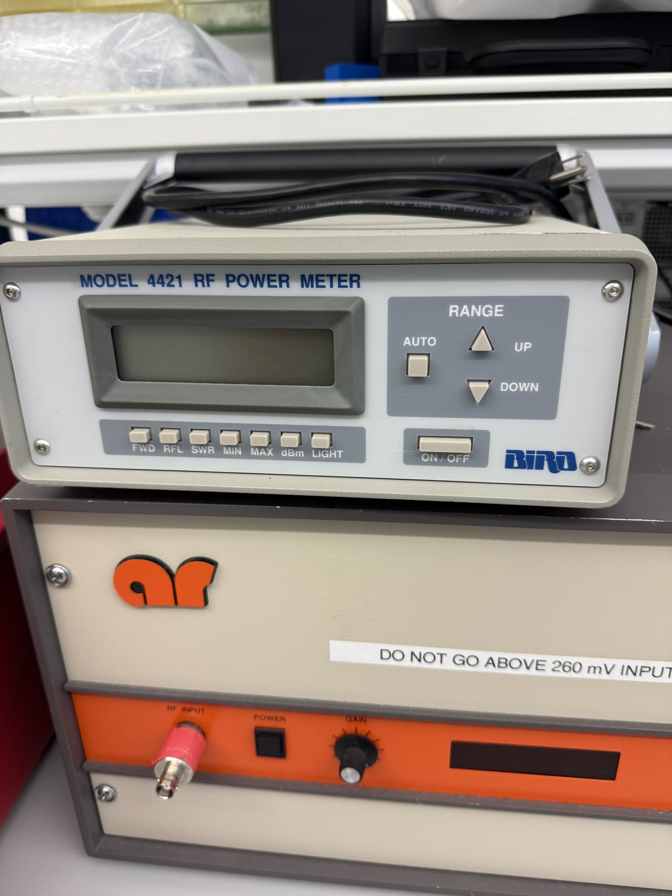

# RF power meter

| | |
|---|---|
| **Official inventory name** | RF power meter |
| **Manufacturer** | Bird |
| **Model** | 4421 (directional) — display head + Model **4021** directional power sensor |
| **Category** | MEASURE |
| **Asset #** | _TODO_ |
| **Location** | Zderic Lab, GW SEH |
| **Status** | confirmed (photo) |

## Photos
_Add 1-6 photos to `photos/`._ (Have: 4421 front panel, 4421 rear connectors, 4021 sensor.)

## Purpose
Measures **forward / reflected** electrical power to the transducer (matching + delivered power).
Delivered electrical power = **P_fwd − P_refl**. CONFIRMED in photos.

## Basic operating principle
This is a **two-piece system**, not a single thru-line wattmeter (it is NOT the old Bird 43 with plug-in
"slugs"):
- **4421 = display head only.** The RF does **not** pass through it — it has **no RF connector**. Rear
  panel: **POWER SENSOR** jack (RJ-style modular, the sensor cable), a **25-pin RS-232** D-sub, a **blue
  24-pin GPIB/IEEE-488** connector, and two red 8-position **DIP-switch** banks (serial config).
- **4021 = directional power sensor (the thru-line piece).** The RF passes through **this**: **SOURCE**
  and **LOAD** N-type ports (arrow SOURCE→LOAD). A short RJ "Sensor Input" cable runs from the 4021 to the
  4421's POWER SENSOR jack.
- **4021 ratings:** **1.8–32 MHz, 0.3–1000 W** (1200 W max). For our 2 MHz work fs = 2.013 MHz is in-band
  (near the low edge) and ~0.5–2 W drive is just above the 0.3 W floor — usable but marginal on both ends.
  A **4027A2M (1.5–2.5 MHz)** sensor, if the lab has one, is better-centered and better at ~1 W.

## Typical settings
- Front panel: **FWD / RFL / SWR / MIN / MAX / dBm / LIGHT**, RANGE **AUTO / UP / DOWN**, **ON/OFF**.
- Power on → self-test shows "4421". Use **RANGE = AUTO**; press **FWD** for forward, **RFL** for reflected.
- Orient the 4021: **SOURCE → amp output, LOAD → element/dummy load** (reversing swaps fwd/refl).

## Safety considerations
- **Power the 4421 OFF before connecting/disconnecting the 4021 sensor** (front-panel caution label).
- **Never disconnect the sensor under RF power** (front-panel warning).
- Do **not** use with load VSWR > 2:1 (can damage meter/sensor).
- Upstream: the AR 150A100B amp is marked **"DO NOT GO ABOVE 260 mV INPUT"** — keep the func gen tiny.

## Connected equipment / typical workflow
STEP 2 drive chain (md`):
`Agilent 33250A → AR 150A100B → [4021 SOURCE→LOAD] → element (in water)`, with `4021 Sensor Input → 4421`.
Amp-into-**50 Ω dummy load** check FIRST, then the element. Delivered power = P_fwd − P_refl.

## Manuals / datasheet / software
- **Manual (Bird 4421):** https://birdrf.com/hubfs/discontinued-manuals/920-4421_rf-power-meter.pdf
  (full title: *Thruline RF Power Meter Model 4421 and Thruline Directional RF Power Sensors*).
- **Website:** https://birdrf.com/
- QR code: _generate from the Manual/software URL above_

## Relevant publications
- _TODO_

## Research ideas (what could we do with this today?)
- _TODO_

## Lab notes
<!-- date / who / what happened. Append freely. -->
- 2026-07-10 (Kevin): confirmed the unit is a **4421 display head + 4021 sensor** (1.8–32 MHz, 0.3–1000 W).
  Sensor already cabled to the 4421 POWER SENSOR jack. Identified rear connectors (POWER SENSOR RJ,
  25-pin RS-232, blue GPIB). fs = 2.013 MHz is in-band but near both the frequency and power floors —
  flagged the 4027A2M as a better 2 MHz option if available.
