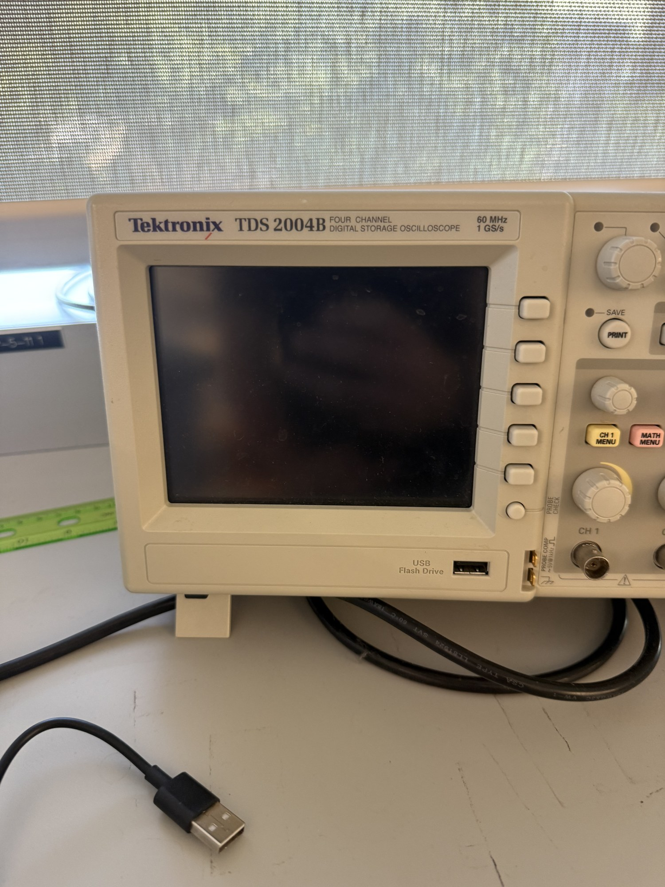

# Oscilloscopes

| | |
|---|---|
| **Official inventory name** | Oscilloscopes |
| **Manufacturer** | Tektronix |
| **Model** | **MDO3024** (200 MHz, 2.5 GS/s, MDO3MSO upgrade, has built-in AFG); also TDS 420 & TDS 2004B |
| **Category** | MEASURE |
| **Asset #** | _TODO_ |
| **Location** | Zderic Lab, GW SEH |
| **Status** | confirmed (photos: MDO3024 + TDS 2004B) |

## Photos
_Add 1-6 photos to `photos/`._ (on hand: MDO3024 front panel.)

## Purpose
Time-domain capture of echoes, hydrophone signals, drive waveforms. **MDO3024 CONFIRMED in photos** (200 MHz, 2.5 GS/s) - PREFER this one: bandwidth is ample for capturing the 2 MHz hydrophone signal, and it has a **built-in AFG (arbitrary function generator)**, a low-level drive source in addition to the standalone function generators (item 20). TDS 2004B also confirmed.

## Basic operating principle
_TODO_

## Typical settings
_TODO_

## Safety considerations
_TODO_

## Connected equipment / typical workflow
-> Hydrophone/echo -> Scope

## Manuals / datasheet / software
- **Manual (TDS2000B series):** https://download.tek.com/manual/071181702web.pdf
- **MDO3024 (PREFER - 200 MHz + AFG) product/manual:** https://www.tek.com/en/products/oscilloscopes/mdo3000
- **Website:** https://www.tek.com/
- QR code: _generate from the Manual/software URL above_

## Relevant publications
- _TODO_

## Research ideas (what could we do with this today?)
- _TODO_

## Lab notes
<!-- date / who / what happened. Append freely. -->
