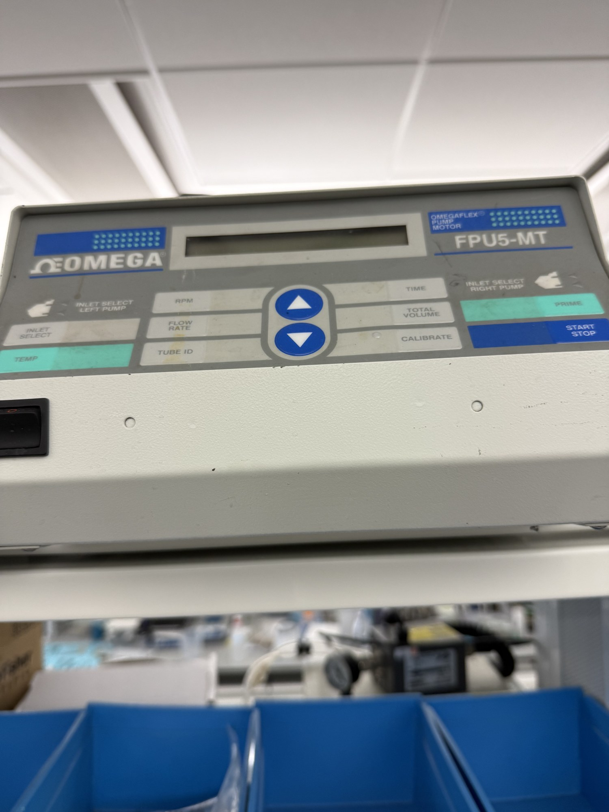

# Flow phantom + peristaltic pump

| | |
|---|---|
| **Official inventory name** | Flow phantom + peristaltic pump |
| **Manufacturer** | Omega |
| **Model** | FPU5-MT |
| **Category** | FLOW |
| **Serial** | FPU5-MT-110-0611268 |
| **Asset #** | _TODO_ |
| **Location** | Zderic Lab, GW SEH |
| **Status** | confirmed (photo) |

## Photos
_2 photos in `photos/`._
## Purpose
Pumps fluid at a KNOWN velocity through a vessel phantom = ground truth for Doppler velocity and the angle-corrected-MFV test. CONFIRMED in photos.

## Basic operating principle
Dual-head peristaltic (OMEGAFLEX). Two independent heads, INLET SELECT LEFT PUMP / RIGHT PUMP.
120 V / 60 Hz, 2 A fuse.

## Front panel
RPM, FLOW RATE, TUBE ID, TIME, TOTAL VOLUME, CALIBRATE, INLET SELECT, TEMP, PRIME, START/STOP.

**TUBE ID plus FLOW RATE is what makes this a velocity reference.** Set the tube inner diameter
and the pump reports volumetric flow, so mean velocity follows directly:

    v = Q / A,   A = pi * (ID/2)^2

That is the ground truth for any Doppler velocity measurement. CALIBRATE exists to correct for
tubing wear, which matters because peristaltic tubing changes bore with use - recalibrate before
quoting a velocity.

## Rear panel
Aux In (V+, GND) and Aux Out (V+, GND) terminal block, Language select, Zero and Span trim pots,
TC-K thermocouple jack (the TEMP readout), IEC inlet.

### Aux terminals - ANSWERED 2026-08-18 from the manual (M2299, sections 6.6.1 / 6.6.2)

Manual pulled to `FPU5-MT_manual_M2299.pdf` in this folder, direct from
`assets.omega.com/manuals/M2299.pdf`. The only reference on file before was a manualslib link.

**There is NO analog speed control on this pump.** Both Aux terminals are digital.

| terminal | what it actually is |
|---|---|
| **Aux In** | Remote start/stop. **Momentarily short V+ to GND and the pump TOGGLES** between running and stopped. "May be achieved with proper TTL or CMOS circuitry." |
| **Aux Out** | Run/stop status only. Monitor with a user-supplied 9 V, 500 ohm and an LED: **LED ON = stopped**, off = running. |
| **Zero / Span pots** | **Type K thermocouple calibration.** Nothing to do with the Aux terminals. |

RPM range is 10 to 600.

**Consequence for a pulsatile (cardiac) phantom.** Aux In cannot play a waveform, and because it
is a TOGGLE rather than a level, gating it at ~1 Hz needs two pulses per cardiac cycle and any
missed or extra pulse permanently inverts systole and diastole with nothing to detect it.
Start/stopping a geared peristaltic head at 1 Hz is also unlikely to be crisp.

**Use a solenoid pinch valve instead.** Run the pump steady for mean flow, put an air-filled
compliance chamber and an adjustable clamp downstream, and let the valve set the systolic
fraction. That is also the better physical analogy: a heart is an intermittent pump and aortic
compliance is what produces the exponential diastolic decay, so tuning R and C gives a
physiological pulsatility index with flow that never reaches zero in diastole.

Aux Out is still worth wiring, as a hardware "the pump is actually running" flag in the session
log. Not knowing the pump state cost real time on 2026-08-18.

## Tubing on hand (confirmed by photo 2026-08-17)

| | |
|---|---|
| ID | **3/32 in = 2.38 mm** |
| OD | 5/32 in = 3.97 mm |
| wall | 1/32 in = 0.79 mm |
| length | 50 ft = 15.2 m |
| lot / serial | 32189060 / 00382 |
| received | 02/2025 |

> **RESOLVED 2026-08-18: 1/8 in tubing fitted and it primes.** Diagnosis confirmed - wall
> thickness was the entire problem and the pump was never at fault. Working sizes and the velocity
> mapping are below; the failed 3/32 in roll is kept on record so the mistake is not repeated.
>
> **Fitted tubing: 1/8 in ID (3.175 mm), area 0.0792 cm2.** Set **TUBE ID = 1/8 in** on the pump.
>
> | velocity | flow |
> |---|---|
> | 50 cm/s | 237 mL/min |
> | 60 cm/s | 285 mL/min |
> | 80 cm/s | 380 mL/min |
>
> All inside the 9-540 mL/min range for this size, mid-scale, and 3.18 mm is closer to real MCA
> calibre than the 2.38 mm originally planned.

> **The 3/32 in roll WILL NOT PUMP. Wrong wall thickness.** Confirmed 2026-08-17: it would not prime
> at any speed. Manual Table 9-2 lists every supported size and they all use a **1/16 in (1.59 mm)
> or 1.5 mm wall**. This roll is **1/32 in (0.79 mm)**, half of that. A 3/32 in ID tube with the
> correct wall would be 5.56 mm OD; this is 3.97 mm. The roller-to-stator gap is fixed, so a tube
> 1.6 mm too thin is never occluded and the pump cannot draw. The ID is non-standard too - 3/32 in
> is not in the supported list, falling between 1/16 and 1/8.
>
> **Order 1/8 in ID x 1/16 in wall (1/4 in OD)** instead. Listed size, 9-540 mL/min, and at
> 3.18 mm it is closer to real MCA calibre than 2.38 mm. The MCA velocity range then sits
> mid-scale: 237 mL/min for 50 cm/s, 285 for 60, 380 for 80. Manual Table 9-3 also gives better
> flow repeatability at 1/8 in (+/-10% between pumps) than at 1/16 in (+/-15%).
>
> Materials the pump accepts: Vinyl, Viton, Tygon, Silicone, Santoprene, Norprene, up to 68
> durometer. Avoid 5/16 in ID Santoprene, which the manual singles out for poor life.

**The 2.38 mm ID would have been a good choice for transcranial work** if the wall were right - close to real MCA calibre (~3 mm) and
small enough that MCA-like velocities need flow rates a peristaltic head can actually deliver.

Cross-sectional area 0.04449 cm2, so mean velocity maps to flow as:

| velocity | flow |
|---|---|
| 20 cm/s | 53 mL/min |
| 40 cm/s | 107 mL/min |
| **50 cm/s** | **133 mL/min** |
| **60 cm/s** | **160 mL/min** |
| **80 cm/s** | **214 mL/min** |
| 100 cm/s | 267 mL/min |

The MCA range of 50-80 cm/s sits at **133 to 214 mL/min**, comfortably mid-scale.

> **SET TUBE ID TO MATCH THE TUBING ACTUALLY FITTED.** The FLOW RATE readout is computed from the tube ID, so
> if that setting is wrong the displayed flow is wrong, and every velocity derived from it is
> wrong by the square of the diameter error. This is the single easiest way to invalidate a
> Doppler validation without noticing.

Peristaltic flow is **pulsatile**, not steady. That is arguably more physiological than a smooth
flow for mimicking an artery, but instantaneous velocity varies through the roller cycle, so a
Doppler spectrum will show that structure. Compare against MEAN velocity, and expect the pump's
roller frequency to appear in the data.

## Sizing for transcranial work
MCA flow is roughly 50-80 cm/s. To hit 60 cm/s:

| tube ID | area | flow needed for 60 cm/s |
|---|---|---|
| 3 mm | 0.071 cm2 | ~250 mL/min |
| 4 mm | 0.126 cm2 | ~450 mL/min |
| 6 mm | 0.283 cm2 | ~1000 mL/min |

**Prefer the smallest practical tube.** A larger bore needs flow rates a peristaltic head may not
reach, and 3 mm is also closer to actual MCA calibre.

## Safety considerations
Mains powered, 120 V. No user serviceable parts. Peristaltic tubing fails by splitting; check it
before a long run rather than after finding water on the bench.

## Connected equipment / typical workflow
Omega Pump -> Flow Phantom -> Sonosite/probe -> velocity

## Manuals / datasheet / software
- **Manual (Omega FPU5-MT):** https://www.manualslib.com/manual/114817/Omega-Engineering-Omegaflex-Fpu5-Mt-110.html
- **Website:** https://www.omega.com/
- QR code: _generate from the Manual/software URL above_

## Relevant publications
- _TODO_

## Research ideas (what could we do with this today?)
- _TODO_

## Lab notes
<!-- date / who / what happened. Append freely. -->

## Priming, from the manual

* **PRIME is a momentary key - hold it down.** Fluid flows only while it is held. Press and
  release does nothing.
* Priming runs at the **current RPM or FLOW RATE setting**, and there is a minimum speed needed to
  prime that varies with tubing size. Prime fast, then set the working rate.
* If it still will not prime, **press on the closed stator while the motor runs**; the manual's own
  trick for improving occlusion. Release once fluid moves.
* The lit green LED points at the **INLET**. Press INLET SELECT to reverse.
* Display FLASHING means STOPPED. Green LEDs FLASHING means RUNNING. This is the opposite of what
  most people assume.
