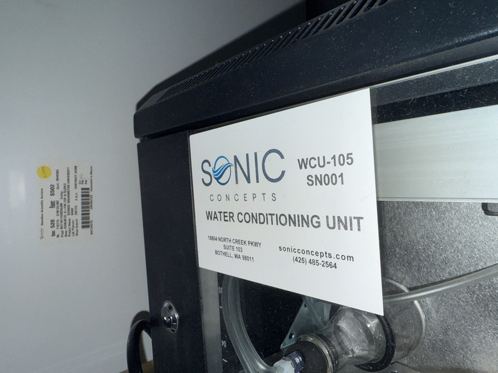

# Water conditioner

| | |
|---|---|
| **Official inventory name** | Water conditioner |
| **Manufacturer** | Sonic Concepts |
| **Model** | WCU-105 |
| **Category** | WATER |
| **Asset #** | _TODO_ |
| **Location** | Zderic Lab, GW SEH |
| **Status** | in official inventory |

## Photos
_1 photo in `photos/`._
## Purpose
Conditions tank water quality.

## Basic operating principle
Recirculating **hydrophobic-membrane vacuum degasser + heater**. Pumps tank water past a membrane under
vacuum to pull dissolved gas out, with a PID heater to hold temperature. The "real" degasser if plumbed to
the tank (vs the Pelco vacuum-flask method, item 36).

## Typical settings
- **Recirc 500-2000 mL/min**, **vacuum ~100 mbar** (confirm on the gauge), **~60 min to <18% saturation**
  (up to 10 L). **300 W PID heater**, water **5-40 C**.
- Target is **<18% saturation, NOT zero**. Plan **~1 hr** before a session.

## Safety considerations
**No tubing kinks** (kills the degas and risks a leak). Confirm the vacuum gauge reads ~100 mbar. Don't run
the heater dry.

## Connected equipment / typical workflow
tank <-> WCU-105 (recirc + degas + heat) -> verify O2 (item 34).md` Day 1 plan.

## Manuals / datasheet / software
- **Datasheet (Sonic Concepts WCU-105):** https://sonicconcepts.com/wp-content/uploads/2020/12/WCU-105-datasheet-digi.pdf
- **Website:** https://sonicconcepts.com/water-coupling/
- QR code: _generate from the Manual/software URL above_

## Relevant publications
- _TODO_

## Research ideas (what could we do with this today?)
- _TODO_

## Lab notes
<!-- date / who / what happened. Append freely. -->
