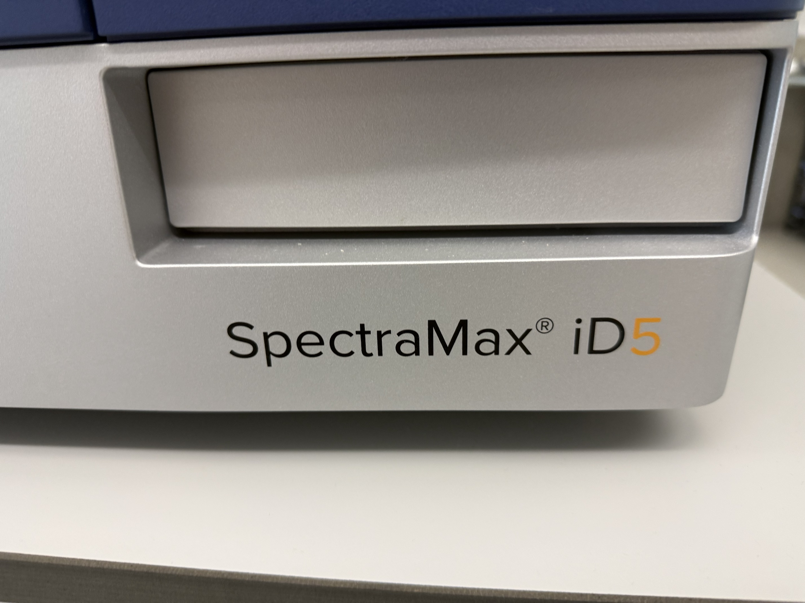

# Microplate reader + Western Blot

| | |
|---|---|
| **Official inventory name** | Microplate reader + Western Blot |
| **Manufacturer** | Molecular Devices |
| **Model** | **SpectraMax iD5** (confirmed from the front panel and the boot screen) |
| **Category** | BIO |
| **Asset #** | _TODO_ |
| **Location** | Zderic Lab, GW SEH 5290 |
| **Status** | **CONFIRMED 2026-09-09** (photographed, powers up) |

## Photos
- `photos/spectramax-id5_front.jpg` - front panel with the plate drawer, model name in
  full.
- `photos/spectramax-id5_touchscreen.jpg` - boot screen, "SpectraMax iD series
  Multi-Mode Microplate Reader". The **green NFC pad** is lit below the screen.

## Purpose
Multi-mode plate reader. It is the readout end of most of the cell and tissue work in
this lab: anything that ends in an absorbance, a fluorescence or a luminescence in a
96- or 384-well plate is read here.

The iD5 is the top of the iD series, so it carries the modes the iD3 does not. Confirm
which options this unit actually has before planning an assay around them, since the
detection cartridges and injectors are purchased separately.

## Basic operating principle
Two optical paths rather than one, which is what "multi-mode" means:

- **Monochromator** for absorbance and for fluorescence where you want to choose
  wavelengths freely. Flexible, slightly less sensitive.
- **Filter path** for fluorescence, luminescence and the time-resolved and polarisation
  modes, where a fixed bandpass gives better rejection and so better sensitivity.

A plate goes in on the drawer, the reader moves each well over the optic, and SoftMax
Pro on the attached PC turns raw counts into concentrations against a standard curve.
The **NFC pad** on the front reads a tag so a protocol can be recalled by tapping a
card rather than navigating the touchscreen.

**Western blot** on this platform is the **ScanLater** cassette: a europium-labelled
secondary antibody read by time-resolved fluorescence in the plate reader, rather than
a chemiluminescent film or a separate imager. It needs the ScanLater cartridge and
holder. Worth confirming those are present, since the inventory name promises the
capability but the hardware is a separate item.

## Typical settings
_TODO - record the read mode, wavelengths, PMT gain and number of flashes with any
result taken on this instrument. Absorbance path length correction on or off matters
for anything reported as a concentration._

## Safety considerations
- Nothing acoustically or electrically hazardous. Ordinary bench instrument.
- The hazards are in the **samples**, not the reader. Human cells and unfixed tissue put
  a plate under the bloodborne pathogens provisions, so read
  [`../../../Safety/`](../../../Safety/README.md) before running human material.
- Plates with volatile solvent should be sealed. Vapour in the optical chamber is a
  slow way to ruin the optics.

## Connected equipment / typical workflow
- PC running **SoftMax Pro** (the reader is usable standalone from the touchscreen, but
  analysis and export live in SoftMax Pro)
- CO2 incubator and laminar hood, item 47, upstream for anything cell-based
- Centrifuges, item 46, and the small-volume spectrophotometer, item 12, for sample prep
- Optional injectors for kinetic assays, if fitted

## Manuals / datasheet / website
- Manual: _TODO (add PDF to `../../../Manuals/molecular-devices/`)_
- Datasheet: _TODO_
- Website: moleculardevices.com, SpectraMax iD5
- QR code: _TODO_

## Relevant publications
The lab's hormone-release work is read out on plate assays, so this instrument sits
behind the insulin, melatonin, adiponectin and thyroid results. Worth linking specific
papers here once the assay used is confirmed.

## Research ideas (what could we do with this today?)
- **Cross-check the QuickDrop.** Item 12 measures small volumes on a pedestal; this
  reads a plate. Running one dilution series both ways is a quick agreement check
  between two instruments that get used interchangeably.
- **Kinetic reads for ultrasound exposure work.** If injectors are fitted, a
  before-and-after exposure assay can be read as a time course in one plate rather than
  as separate endpoints.

## Lab notes
<!-- date / who / what happened. Append freely. -->
- **2026-09-09** Photographed and confirmed as a **SpectraMax iD5**, which matches what
  the page already claimed but had never been verified against the hardware. Moves item
  45 off the not-yet-photographed list. Unit powers up and reaches the application boot
  screen; NFC pad is lit.
  - **Not yet confirmed: which optional modules are actually installed.** The iD5
    supports time-resolved fluorescence, fluorescence polarisation, injectors and the
    ScanLater Western Blot cassette, but each is a separate purchase. The inventory name
    says "+ Western Blot", so the ScanLater cartridge and plate holder should be located
    and recorded here. Absence would make the inventory name wrong.
  - Serial number not captured. It is on the rear or under Settings on the touchscreen,
    and it is what a service call will ask for first.
