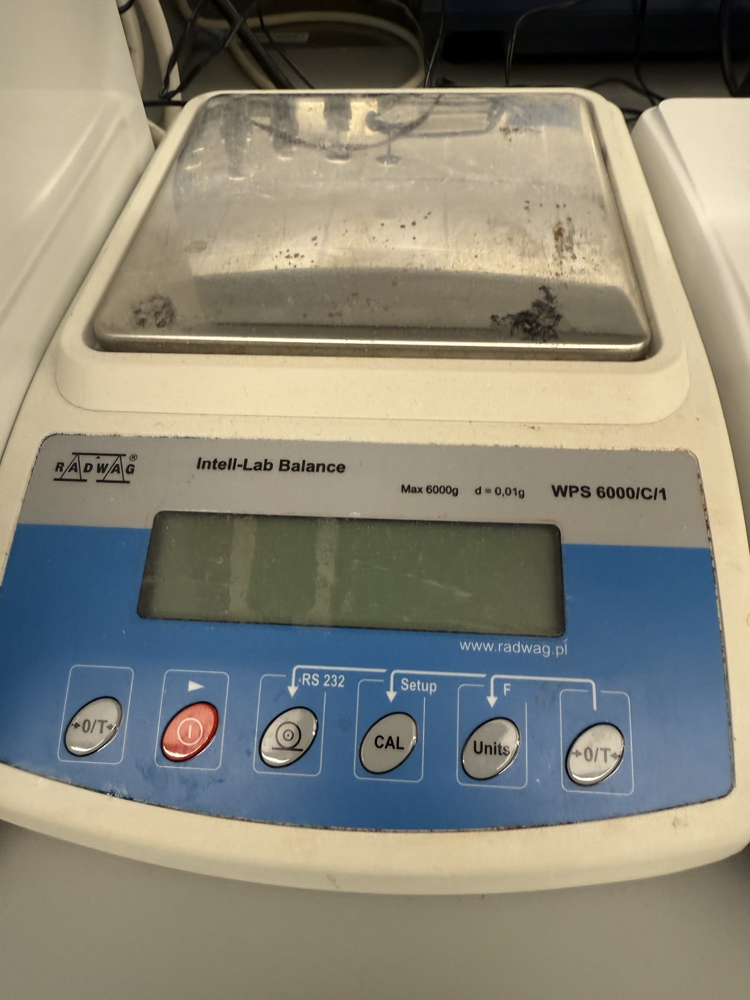

# Bench supplies

| | |
|---|---|
| **Official inventory name** | Bench supplies |
| **Manufacturer** | (various) |
| **Model** | - |
| **Category** | MISC |
| **Asset #** | _TODO_ |
| **Location** | Zderic Lab, GW SEH |
| **Status** | in official inventory |

## Photos
_2 photos in `photos/`._
## Purpose
50 Ohm dummy load, absorbers, digital calipers, soldering tools, flowmeters, phantom chemicals, heat gun, water tanks, transformers, contrast agents, imaging gels.

## Basic operating principle
_TODO_

## Typical settings
_TODO_

## Safety considerations
_TODO_

## Connected equipment / typical workflow
_TODO_

## Manuals / datasheet / website
- Manual: _TODO (add PDF to `../../Manuals/various/`)_
- Datasheet: _TODO_
- Website: _TODO_
- QR code: _TODO_

## Relevant publications
- _TODO_

## Research ideas (what could we do with this today?)
- _TODO_

## Lab notes
<!-- date / who / what happened. Append freely. -->
