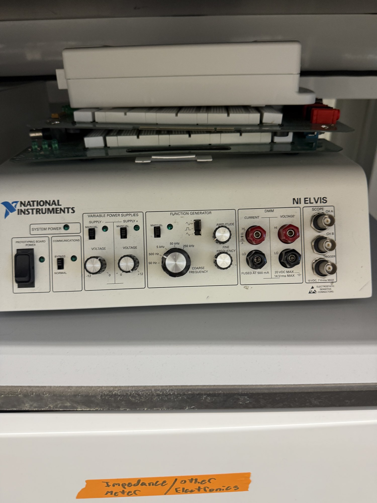

# NI ELVIS (all-in-one instrumentation station)

| | |
|---|---|
| **Official inventory name** | NI ELVIS |
| **Manufacturer** | National Instruments |
| **Model** | NI ELVIS (original benchtop workstation) |
| **Category** | DC / low-freq prototyping |
| **Status** | found in photos - NOT on official list (add) |

## Purpose
Benchtop prototyping station: **variable +/-12 V supplies, DMM, and a breadboard**, plus a function generator
and DAQ-scope. **IMPORTANT LIMIT (confirmed from the panel photo): the function generator tops out at ~250 kHz
and the DAQ scope is low-bandwidth - it CANNOT drive or observe a 2 MHz ultrasound signal.** It is NOT a piezo
impedance analyzer (that's the Bode 100).

**Use it for:** building and checking the **DC / low-frequency circuits** - matching network, T/R switch,
preamp, board-support/logic - on the breadboard with the +/-12 V supplies and DMM.
**Do NOT use it for:** the 2 MHz signal path (drive = Agilent 33522A; capture = Tektronix MDO3024; impedance =
Bode 100).

## Connected equipment / typical workflow
NI ELVIS supplies + DMM + breadboard <-> DC/low-freq test of a matching / T-R / preamp circuit. The 2 MHz
drive + capture happen on the 33522A / MDO3024, not the ELVIS.

## Manuals / datasheet / software
- **NI ELVIS (product + docs):** https://www.ni.com/en/shop/electronic-test-instrumentation/ni-elvis.html
- **SOFTWARE - NI ELVISmx driver:** https://www.ni.com/en/support/downloads/drivers/download.ni-elvismx.html
- QR code: _generate from the Manual/software URL above_

## Lab notes
