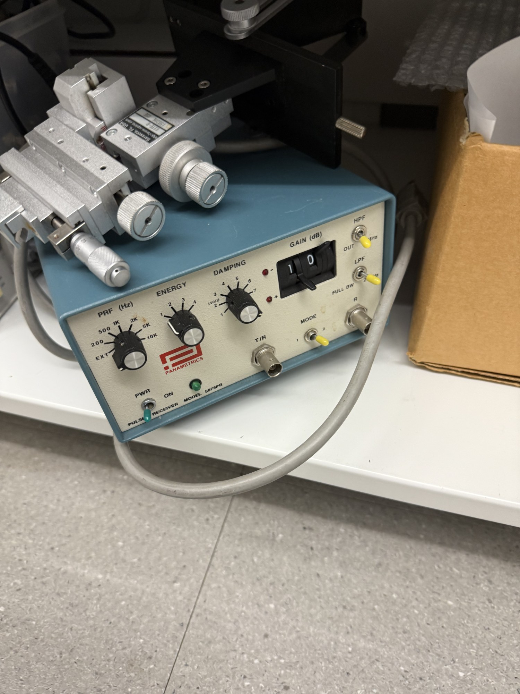

# Panametrics 5073PR pulser / receiver

| | |
|---|---|
| **Official inventory name** | Ultrasonic pulser / receiver |
| **Manufacturer** | Panametrics (Olympus NDT) |
| **Model** | 5073PR |
| **Category** | DRIVE / MEASURE |
| **Status** | found in photos - NOT on official list (add). 2nd pulser/receiver alongside the UTEX UT340 (item 52). |

## Purpose
Square-wave / spike pulser + wideband receiver for pulse-echo: fire a transducer and amplify the returning
echoes on the same line. 5073PR is the 75 MHz-class Panametrics unit (below the 5077PR referenced generically
in the workflows). Workhorse for time-of-flight, ring-down, interface/flaw echoes, and detection-floor work.

## Typical settings
_TODO: PRF, energy, damping, gain, filter band for a 2 MHz element._

## Connected equipment / typical workflow
5073PR -> transducer -> water tank -> echo -> receiver -> Tektronix scope / NI PXIe -> Python.

## Manuals / datasheet / software
- **Datasheet (507-series PR):** http://cdn-docs.av-iq.com/dataSheet/507_Series-Datasheet.pdf
- **Website (Olympus/Evident):** https://www.olympus-ims.com/
- QR code: _generate from the Manual/software URL above_

## Lab notes
