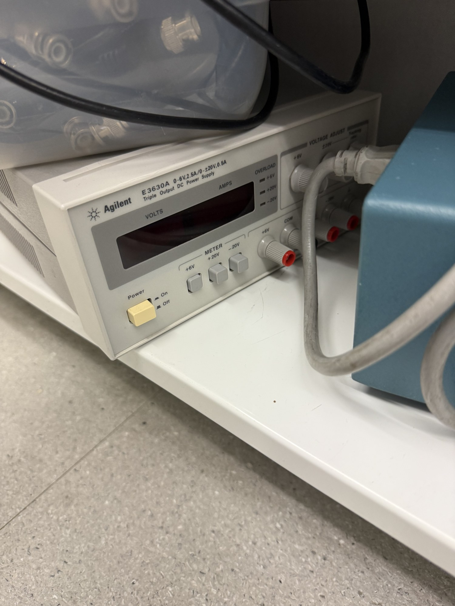

# DC power supply

| | |
|---|---|
| **Official inventory name** | DC power supply |
| **Manufacturer** | Agilent (Keysight) |
| **Model** | E3630A - triple output: 0-6 V / 2.5 A and 0 to ±20 V / 0.5 A |
| **Category** | DRIVE / support |
| **Asset #** | _TODO_ |
| **Location** | Zderic Lab, GW SEH |
| **Status** | confirmed (photo 2026-07) - NOT on official list (add) |

## Photos
_Add 1-6 photos to `photos/`._ (on hand: E3630A front panel.)

## Specs
- **+6 V output:** 0-6 V, up to 2.5 A.
- **±20 V tracking outputs:** 0 to ±20 V, up to 0.5 A each.
- Triple output gives +, -, and logic rails from one unit. Metered volts/amps, overload indicators.

## Purpose
Bench DC supply for powering driver and board circuits during bring-up: logic rails, matching and T-R circuit test rigs, preamps. Triple output gives + / - / logic rails from one unit.

## Notes
- The ±20 V / 0.5 A rails suit op-amp / AFE bring-up. The 6 V / 2.5 A rail suits logic and the 5 V input to the boost stage.
- Not a high-voltage source. Boards needing an HV rail generate it on-board.

## Lab notes
