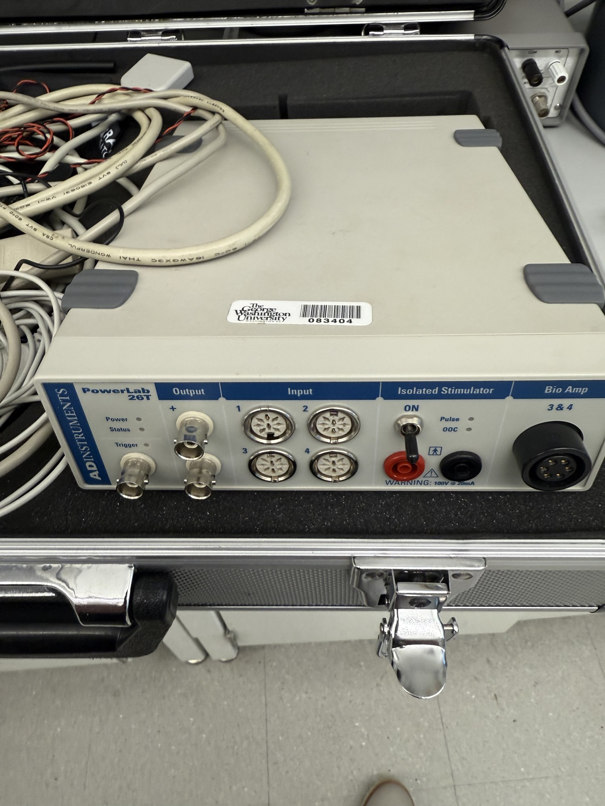

# ADInstruments PowerLab 26T (data acquisition)

| | |
|---|---|
| **Official inventory name** | Data acquisition system |
| **Manufacturer** | ADInstruments |
| **Model** | PowerLab 26T |
| **Category** | MEASURE / COMPUTE |
| **Status** | found in photos - NOT on official list (add) |

## Purpose
Multi-channel physiological DAQ (with LabChart): records analog signals - pressure, flow, ECG, temperature,
and general voltage - at high resolution. Useful for logging flow-phantom pressure/flow, driver waveforms, and
any bench analog channel alongside the acoustic measurements.

## Connected equipment / typical workflow
transducer/phantom analog outputs -> PowerLab 26T -> LabChart -> export -> Python/MATLAB.

## Manuals / datasheet / software
- **ADInstruments PowerLab:** https://www.adinstruments.com/products/powerlab
- **SOFTWARE - LabChart:** https://www.adinstruments.com/products/labchart
- QR code: _generate from the Manual/software URL above_

## Lab notes
