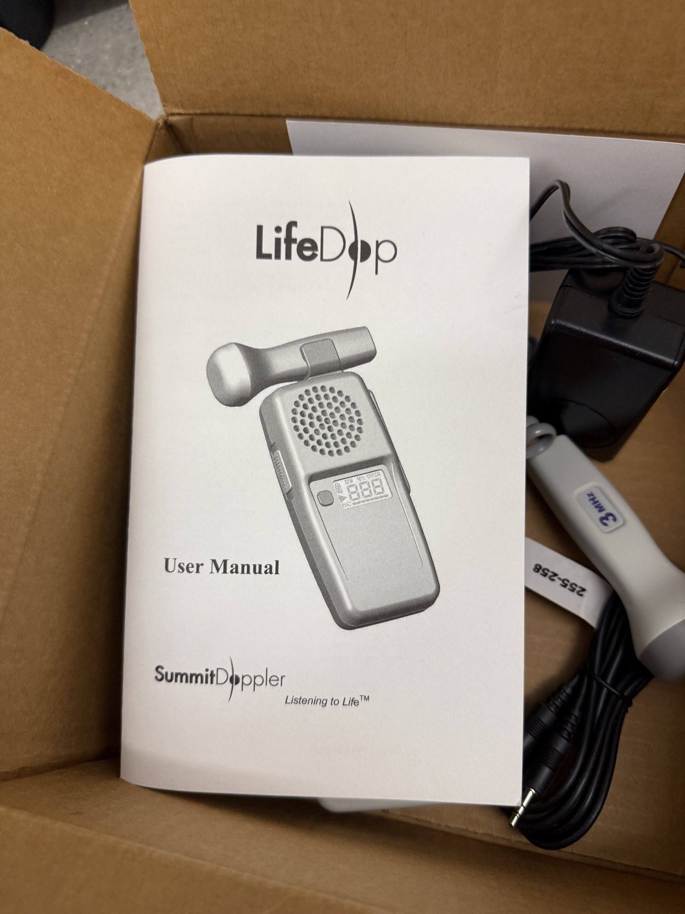

# Summit Doppler LifeDop (handheld CW Doppler)

| | |
|---|---|
| **Official inventory name** | Handheld Doppler |
| **Manufacturer** | Summit Doppler (Cooper Surgical) |
| **Model** | LifeDop |
| **Category** | IMAGING / Doppler |
| **Status** | found in photos - NOT on official list (add) |

## Purpose
Handheld continuous-wave Doppler (peripheral-vascular / obstetric probes, ~2-8 MHz). A simple, deskilled CW
Doppler reference - useful for the carotid / peripheral-flow thread and as an easy audible-Doppler comparison
for the flow phantom.

## Connected equipment / typical workflow
LifeDop probe -> vessel / flow phantom -> audible + analog Doppler output.

## Research ideas
- CW Doppler audio and spectral reference on the flow phantom.
- Carotid/peripheral hand-held Doppler comparison (PLATFORM_2 medical thread).

## Lab notes
